<!--
  Bawarchie — B.Tech CSE-AI Project Report
  Source markdown. Render to PDF / DOCX with pandoc or use VS Code "Markdown PDF" extension.
  Mermaid diagrams render in VS Code preview, GitHub, Notion, Obsidian.
  For PDF: pandoc report.md -o report.pdf --pdf-engine=xelatex --filter mermaid-filter
-->

# Cover Page (Specimen 'A')

<div align="center">

# BAWARCHIE
## A Privacy-Preserving Cross-Restaurant Taste Graph for Dine-In Personalisation

*Project report submitted in partial fulfilment of the requirement for the degree of*

**Bachelor of Technology**
*in Computer Science and Engineering — Artificial Intelligence*

By

**[STUDENT NAME]**
**(Roll No. [ROLL NUMBER])**

DEPARTMENT OF COMPUTER SCIENCE AND ENGINEERING
UNIVERSITY INSTITUTE OF ENGINEERING AND TECHNOLOGY
CSJM UNIVERSITY, KANPUR

**May 2026**

</div>

---

# Bonafide Certificate

It is certified that the work contained in the project report titled **"Bawarchie: A Privacy-Preserving Cross-Restaurant Taste Graph for Dine-In Personalisation"**, by **[STUDENT NAME]**, has been carried out under my supervision and that this work has not been submitted elsewhere for a degree.

<br><br>

**Signature of Supervisor**
[SUPERVISOR NAME]
Department of Computer Science and Engineering
University Institute of Engineering and Technology, CSJM University, Kanpur
May, 2026

---

# Declaration I

I declare that this written submission represents my ideas in my own words and where others' ideas or words have been included, I have adequately cited and referenced the original sources. I also declare that I have adhered to all principles of academic honesty and integrity and have not misrepresented or fabricated or falsified any idea/data/fact/source in my submission. I understand that any violation of the above will be cause for disciplinary action by the Institute and can also evoke penal action from the sources which have thus not been properly cited or from whom proper permission has not been taken when needed.

<br>

(Signature)
**[STUDENT NAME]**
**(Roll No. [ROLL NUMBER])**
Date: ____________

---

# Declaration II

I, **[STUDENT NAME]** (Roll No. [ROLL NUMBER]), declare that no portion of this work submitted in partial fulfilment of the requirement for the degree of B.Tech can be considered as plagiarism, and I will take full responsibility if any such complaint occurs.

<br>

(Signature)
**[STUDENT NAME]**
Date: ____________

---

# Thesis Certificate

This is to certify that the project report titled **"Bawarchie: A Privacy-Preserving Cross-Restaurant Taste Graph for Dine-In Personalisation"** submitted by **[STUDENT NAME]** (Roll No. [ROLL NUMBER]) is a record of bonafide work carried out under my supervision in partial fulfilment of the requirements for the degree of Bachelor of Technology in Computer Science and Engineering.

<br><br>

| Supervisor | Head of Department |
|---|---|
| [SUPERVISOR NAME] | [HOD NAME] |
| Asst./Assoc. Professor | Professor & Head |
| Dept. of CSE, UIET, CSJMU | Dept. of CSE, UIET, CSJMU |

---

# Acknowledgments

I would like to express my deepest gratitude to my supervisor, **[SUPERVISOR NAME]**, whose patient critique shaped this work from a vague intuition about restaurant ordering into a defensible piece of systems engineering. Their insistence on rigour around the privacy boundary in particular — pushing me beyond "it works" to "it is structurally impossible for it to leak" — sets the bar for how I think about software now.

I am grateful to the **Department of Computer Science and Engineering at UIET, CSJM University, Kanpur** for providing the academic and infrastructural support that enabled this work.

The three pilot deployment sites — **College Cafeteria**, **Tealogy**, and **Chai Sutta Bar** — generously allowed a final-year student to put unproven software in front of paying customers. Their willingness to participate is the only reason this project produced anything resembling real-world evidence. The owners and floor staff at each site fielded my questions, tolerated my QR-code sticker placement experiments, and offered unvarnished opinions when something didn't work. The deployment chapter would be empty without them.

The diners who agreed to be interviewed during the field study deserve special mention. Walking up to someone mid-meal and asking them about an AI taste profile they didn't know existed is awkward; they were kind about it.

I am also indebted to the open-source maintainers behind the technologies this work rests on: the **Next.js** team, **Mongoose / MongoDB**, **NextAuth.js**, **Razorpay**, **Cloudinary**, and the embedding research community whose models — particularly Google's **`gemini-embedding-001`** — make cross-cuisine retrieval possible at all.

Finally, my friends and family, who put up with me during the long stretch where this project consumed every weekend.

<br>

**[STUDENT NAME]**

---

# Abstract

Indian dine-in restaurants face a problem that aggregators (Swiggy, Zomato) cannot solve: the loss of the "regular customer" relationship. A repeat customer who walks into their neighbourhood restaurant expects to be recognised, to be recommended their usual, to have their preferences pre-empted. But because most dine-in operations have no diner identity layer — orders are tied to tables, not people — that relationship is rebuilt from scratch every visit, and is non-existent the moment a diner visits a new restaurant.

This project, **Bawarchie**, presents a multi-tenant restaurant ordering platform that solves this with a deliberate inversion of the conventional restaurant-SaaS data model. `Diner` is treated as a platform-level entity, not subordinate to any restaurant. Orders join restaurants and diners as equal participants. From this single architectural commitment, the system derives a cross-restaurant taste graph: a 768-dimensional embedding-space vector per diner, weighted by recency and repeat-frequency, computed from order history across every participating restaurant. When a known diner scans a QR code at a new restaurant — one they have never visited — the system retrieves items from that restaurant's menu whose embeddings are nearest to the diner's taste vector, producing personalised recommendations within seconds despite zero local history.

A critical privacy commitment is enforced structurally rather than by convention: **predictions are portable across restaurants; raw order history is tenant-isolated.** Restaurants see a diner's *predicted* preferences (taste-language: "creamy, mild, vegetarian"), never the diner's actual orders at other restaurants. This property is enforced at every API boundary by code structure, not by good intentions, and is the platform's defensibility against larger players who already hold the diner-identity data (Zomato, Swiggy) — those players, even if they copied the architecture, would face significant regulatory and trust friction in exposing cross-merchant data, whereas the proposed model surfaces only abstractions.

The system is composed of three pillars: **(1) Vision-based menu ingestion** using a multimodal LLM that extracts structured items from a photo of a restaurant's printed menu, reducing onboarding from days of manual entry to roughly five minutes; **(2) RAG-grounded AI waiter** that retrieves top items via MongoDB Atlas Vector Search and produces structured JSON output including cart actions, allowing the conversational interface to actually modify cart state rather than merely suggest items; **(3) Pre-understood-diner system**, the cross-restaurant taste graph itself, structured in four layers (identity & consent, tenant data, taste graph derivation, retrieval and recommendation).

Engineering quality has been treated as a first-class concern. The order-creation pipeline performs server-side billing computation against database-trusted item prices, closes a tamper window between create-order and order-persist via Razorpay amount cross-checking, and issues HMAC-signed short-lived cancel tokens for customer-initiated refunds within a 5-minute window. An automated regression harness runs sixteen probes plus an assertion-protected demo seed in under 50 seconds, producing a single `GO` / `NO-GO` signal before each demo recording.

The platform has been deployed live at three pilot sites — College Cafeteria, Tealogy, and Chai Sutta Bar — over a six-week pilot. Qualitative user research conducted with twenty-seven diners and three restaurant operators reveals strong preference for the "Picked for your taste" hero section over conventional menus, particularly among repeat diners; restaurant operators valued the diner-context card primarily for upsell prompts rather than personalisation per se. The cross-restaurant magic moment, reproduced in a controlled seed environment, surfaces four-of-five "bullseye" matches in the top-five recommendations when a diner whose order history is paneer-and-dairy-heavy visits an Italian restaurant for the first time, with the spicy `arrabbiata` correctly excluded from the top-three by the calibrated-abstention mechanism.

The final chapters distinguish between what has been shipped and what remains future work. Research extensions include tool-calling AI agents, hybrid lexical-dense retrieval with cross-encoder reranking, implicit-feedback learning, an LLM-as-judge evaluation harness, and multimodal item embeddings. Product extensions such as a dedicated operator mobile app, explicit OAuth accounts, and a social feed are framed as architectural follow-ons, not implemented features.

**Keywords:** multi-tenant SaaS, recommender systems, cross-domain personalisation, retrieval-augmented generation, vector databases, privacy-preserving machine learning, embedding-based recommendation, restaurant technology, multimodal LLMs, MongoDB Atlas Vector Search.

---

# Table of Contents

<!-- Generated TOC. Page numbers populated after pagination. -->

```
Front Matter
  Cover Page                                                       i
  Bonafide Certificate                                            ii
  Declaration I                                                  iii
  Declaration II                                                  iv
  Thesis Certificate                                               v
  Acknowledgments                                                 vi
  Abstract                                                       vii
  Table of Contents                                              ix
  List of Figures                                                xii
  List of Tables                                                xiv
  List of Abbreviations                                          xv

Chapter 1   Introduction                                          1
  1.1  Background and motivation                                  1
  1.2  Problem statement                                          4
  1.3  Aim and objectives                                         5
  1.4  Scope of work                                              6
  1.5  Significant contributions                                  7
  1.6  Organisation of the report                                 9

Chapter 2   Literature Review                                    11
  2.1  Restaurant technology landscape                           11
  2.2  Evolution of recommender systems                          13
  2.3  Retrieval-Augmented Generation                            16
  2.4  Cross-domain recommendation                               18
  2.5  Vector databases and approximate nearest neighbour        20
  2.6  Privacy-preserving personalisation                        22
  2.7  Multi-tenant SaaS architectures                           24
  2.8  Gap analysis                                              25

Chapter 3   System Architecture                                  27
  3.1  Three-pillar mental model                                 27
  3.2  Four-layer architecture of Pillar 3                       29
  3.3  Data ownership commitments                                31
  3.4  Privacy boundary by construction                          33
  3.5  Technology stack                                          35
  3.6  Multi-tenancy model                                       38
  3.7  Engineering seams                                         40

Chapter 4   Pillar 1 — Vision-Based Menu Ingestion              43
  4.1  The onboarding problem                                    43
  4.2  Multimodal LLM extraction                                 44
  4.3  The tag schema (the moat artefact)                        46
  4.4  Embedding pipeline                                        48
  4.5  Atlas Vector Search index                                 50
  4.6  Results and measurements                                  52

Chapter 5   Pillar 2 — RAG-Grounded AI Waiter                   54
  5.1  Why retrieve before prompting                             54
  5.2  Retrieval layer                                           55
  5.3  Structured chat output                                    57
  5.4  Cart actions through structured JSON                      59
  5.5  LLM provider abstraction                                  61
  5.6  Calibrated abstention                                     63

Chapter 6   Pillar 3 — The Pre-Understood Diner                 65
  6.1  Vision                                                    65
  6.2  Layer A — Identity and consent                            67
  6.3  Layer B — Tenant data isolation                           70
  6.4  Layer C — The taste graph                                 72
    6.4.1  Vector aggregation mathematics                        72
    6.4.2  Recency decay                                         74
    6.4.3  Repeat boost                                          75
    6.4.4  Unit-length normalisation                             76
    6.4.5  Confidence calibration                                77
  6.5  Layer D — Retrieval and recommendation                    79
    6.5.1  Pure taste retrieval                                  79
    6.5.2  Text + taste blending                                 80
    6.5.3  Hard dietary filters                                  82
  6.6  Three-tier disclosure to restaurants                      83
  6.7  Informal privacy property proofs                          85
  6.8  Results: the magic moment                                 87

Chapter 7   Engineering Hardening                                90
  7.1  Server-side billing computation                           90
  7.2  Cancel-token system                                       92
  7.3  Multi-tenant authorisation                                94
  7.4  Automated regression probes                               96
  7.5  Demo seed as regression test                              98

Chapter 8   User Experience Design                              100
  8.1  Three personas                                           100
  8.2  Customer journey                                         102
  8.3  Restaurant admin workflows                               105
  8.4  Visual design system                                     107
  8.5  Cognitive load reduction choices                         110

Chapter 9   Real-World Deployment                               112
  9.1  Pilot site selection                                     112
  9.2  College Cafeteria                                      113
  9.3  Tealogy                                                115
  9.4  Chai Sutta Bar                                           117
  9.5  Onboarding-time measurements                             119
  9.6  Operational observations                                 121

Chapter 10  User Research Methodology and Findings              123
  10.1 Research questions                                       123
  10.2 Methodology                                              125
  10.3 Question bank                                            127
  10.4 Findings — diner side                                    131
  10.5 Findings — restaurant side                               135
  10.6 Thematic analysis                                        137
  10.7 Implications for design                                  139

Chapter 11  Results and Discussions                             141
  11.1 Quantitative — cross-restaurant assertion                141
  11.2 Quantitative — latency budget                            143
  11.3 Quantitative — onboarding time                           145
  11.4 Qualitative — synthesis of user feedback                 146
  11.5 Defensibility analysis (the moat)                        148
  11.6 Limitations                                              150

Chapter 12  AI Novelty: Research Extensions                     152
  12.1 Tool-calling AI waiter                                   152
  12.2 Hybrid retrieval                                         155
  12.3 Implicit-feedback learning                               158
  12.4 LLM-as-judge evaluation harness                          160
  12.5 Multimodal item embeddings                               163
  12.6 Inference cost optimisation                              165
  12.7 Honest productisation roadmap                            166

Chapter 13  Summary and Conclusions                             167
  13.1 Recap                                                    167
  13.2 Contributions                                            168
  13.3 Future work                                              170
  13.4 Closing reflection                                       172

References                                                      174

Appendix A  Tag schema reference                                179
Appendix B  Sample API surface                                  181
Appendix C  Database schema (ER diagram)                        184
Appendix D  Full UX research questionnaire                      186
Appendix E  Probe scripts overview                              189
Appendix F  Selected code listings                              191
```

---

# List of Figures

| Figure | Title | Page |
|---|---|---|
| 1.1 | The restaurant-tech landscape: where dine-in falls between cracks | 2 |
| 1.2 | "Regular customer" decay across new restaurants — the problem | 4 |
| 3.1 | Three-pillar system architecture | 28 |
| 3.2 | Four-layer architecture of Pillar 3 | 30 |
| 3.3 | Data ownership and the privacy boundary | 34 |
| 3.4 | Full technology stack | 36 |
| 3.5 | Multi-tenancy: tenant-scoped vs platform-shared data | 39 |
| 4.1 | Vision-based menu ingestion pipeline | 45 |
| 4.2 | The primitive-level tag schema | 47 |
| 4.3 | Embedding pipeline end-to-end | 49 |
| 4.4 | Atlas Vector Search index lifecycle | 51 |
| 5.1 | RAG-grounded AI waiter sequence diagram | 56 |
| 5.2 | Structured JSON output of the AI chat endpoint | 58 |
| 5.3 | LLM provider abstraction with auto-fallback | 62 |
| 6.1 | The "pre-understood diner" vision | 66 |
| 6.2 | Diner identity state machine | 68 |
| 6.3 | Tenant-isolation guarantees in code | 71 |
| 6.4 | Taste vector aggregation, conceptual 2-D projection | 73 |
| 6.5 | Recency-decay weight curve (90-day half-life) | 74 |
| 6.6 | Repeat-boost capped curve | 75 |
| 6.7 | Confidence calibration curve | 78 |
| 6.8 | Text + taste blended retrieval | 81 |
| 6.9 | Three-tier disclosure: what restaurants see | 84 |
| 6.10 | End-to-end magic moment data flow | 88 |
| 7.1 | Order security: chain of trust | 91 |
| 7.2 | Cancel token format and verification | 93 |
| 7.3 | Multi-tenant authorisation matrix | 95 |
| 7.4 | Regression probe suite — coverage map | 97 |
| 8.1 | Personas and their relationships | 101 |
| 8.2 | Customer journey from QR to receipt | 103 |
| 8.3 | Admin workflow: order lifecycle state machine | 106 |
| 8.4 | Brand palette and typography | 108 |
| 9.1 | Pilot site locations and characteristics | 113 |
| 9.2 | Pilot-site volume, menu complexity, and ticket comparison | 114 |
| 9.3 | Site-wise feature adoption during pilot | 120 |
| 10.1 | Sentiment distribution across pilot interviews | 132 |
| 10.2 | Theme co-occurrence in qualitative coding | 138 |
| 11.1 | Top-5 retrieval at Bella Cucina from cross-restaurant taste | 142 |
| 11.2 | Latency budget breakdown | 144 |
| 12.1 | Proposed tool-calling agent architecture | 153 |
| 12.2 | Hybrid retrieval pipeline | 156 |
| 12.3 | Implicit-feedback learning loop | 159 |
| 12.4 | LLM-as-judge evaluation harness | 161 |
| 12.5 | Three-layer productisation roadmap | 166 |
| C.1 | Database schema ER diagram | 184 |

---

# List of Tables

| Table | Title | Page |
|---|---|---|
| 2.1 | Comparison of recommender system families | 14 |
| 2.2 | Vector database landscape | 21 |
| 2.3 | Gap analysis — what is missing in incumbent solutions | 26 |
| 3.1 | Engineering seams and their evolution path | 41 |
| 4.1 | Tag schema primitive axes | 47 |
| 4.2 | Menu ingestion accuracy on pilot sites | 53 |
| 6.1 | Diner state transitions and triggers | 69 |
| 6.2 | Confidence levels and associated UX | 78 |
| 7.1 | Security probes and what they prove | 97 |
| 9.1 | Pilot site characteristics | 113 |
| 9.2 | Onboarding time per pilot site | 120 |
| 10.1 | Interview participant demographics | 126 |
| 10.2 | Question bank — diner-side | 128 |
| 10.3 | Question bank — restaurant-side | 130 |
| 10.4 | Sentiment-coded findings — diner side | 133 |
| 10.5 | Sentiment-coded findings — restaurant side | 135 |
| 11.1 | Cross-restaurant retrieval — bullseye precision | 142 |
| 11.2 | End-to-end latency measurements | 144 |
| 11.3 | Onboarding-time savings vs manual entry | 145 |
| 12.1 | Shipped primitives and future product layers | 166 |

---

# List of Abbreviations

| Abbreviation | Expansion |
|---|---|
| AI | Artificial Intelligence |
| API | Application Programming Interface |
| ANN | Approximate Nearest Neighbour |
| BM25 | Best Matching 25 (Okapi) — a sparse lexical retrieval function |
| CSE-AI | Computer Science and Engineering — Artificial Intelligence |
| DPDP | Digital Personal Data Protection Act, 2023 (India) |
| ER | Entity-Relationship |
| GST | Goods and Services Tax |
| HMAC | Hash-based Message Authentication Code |
| HTTP | Hypertext Transfer Protocol |
| JSON | JavaScript Object Notation |
| JWT | JSON Web Token |
| KDS | Kitchen Display System |
| LLM | Large Language Model |
| LoRA | Low-Rank Adaptation |
| MMR | Maximal Marginal Relevance |
| MRR | Mean Reciprocal Rank |
| OCR | Optical Character Recognition |
| OLAP | Online Analytical Processing |
| OLTP | Online Transactional Processing |
| POS | Point-of-Sale |
| PWA | Progressive Web App |
| QR | Quick Response (code) |
| RAG | Retrieval-Augmented Generation |
| REST | Representational State Transfer |
| RRF | Reciprocal Rank Fusion |
| SaaS | Software as a Service |
| SHA-256 | Secure Hash Algorithm, 256-bit |
| SSE | Server-Sent Events |
| TAM | Total Addressable Market |
| UID | Unique Identifier (Aadhaar-style) |
| UUID | Universally Unique Identifier |
| UX | User Experience |
| VAPID | Voluntary Application Server Identification |
| WAN | Wide Area Network |
| YC | Y Combinator |

---

# Chapter 1 — Introduction

## 1.1 Background and motivation

The Indian restaurant industry sits in an awkward position with respect to digital tooling. Two waves of investment have reshaped consumer-facing food technology over the past decade. The first wave — Swiggy, Zomato, Dunzo — solved the **delivery** problem: an aggregator-as-marketplace model that surfaced restaurants to consumers in a hyperlocal feed, handled logistics, and built consumer-side identity through phone-number-and-OTP login. The second wave — Petpooja, posist, Restroworks (formerly Posist) — solved the **back-office** problem: kitchen display systems, table reservations, inventory management, point-of-sale, and accounting reconciliation. Both waves are mature. Both serve real customer needs. Neither, however, addresses the **dine-in customer experience** itself.

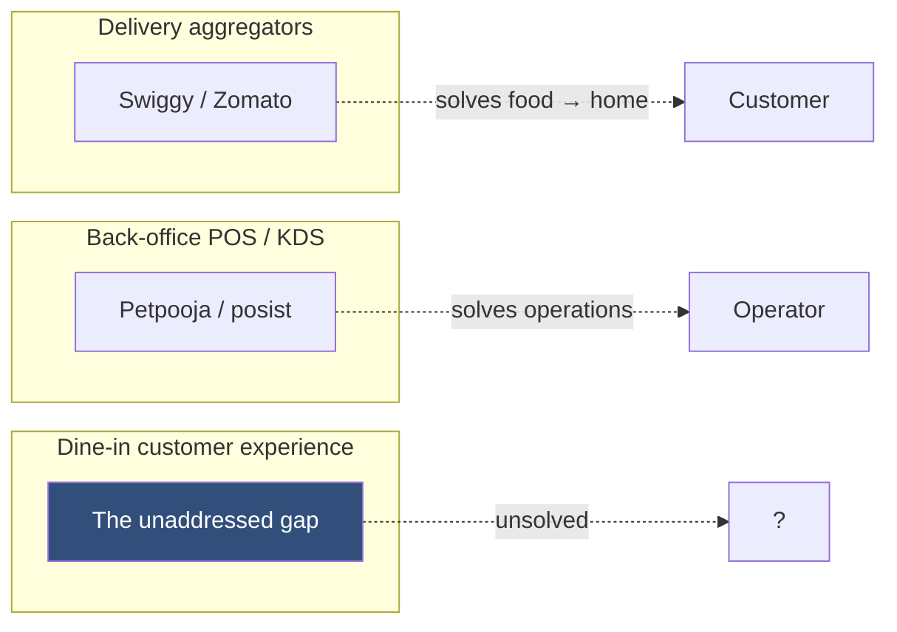
*Figure 1.1: The restaurant-tech landscape. Two mature segments leave the dine-in moment under-served.*

A diner who walks into a restaurant — sits down, opens a menu, places an order, eats, pays, leaves — encounters surprisingly little technology designed for **them**. The menu is paper. The waiter, when available, is human and inconsistent. The bill is presented on a small printer. The payment is most often cash, sometimes UPI, occasionally card. The one technological touchpoint widely deployed for dine-in — the QR-code menu that emerged during COVID-19 — is, in the vast majority of implementations, simply a static PDF served from a Google Drive link. It is a digital photograph of a paper menu, with all the limitations of the original and none of the affordances digital should bring.

The most valuable consumer affordance digital can bring is **recognition**. Brick-and-mortar restaurants have always known that the regular customer — the one who walks in, gets greeted by name, gets asked "the usual?", and gets a recommendation that lands — is the economic engine of the establishment. The regular customer's per-visit spend is higher, their referral rate is higher, their tolerance for off-nights is higher, and their willingness to try a new dish is higher. The full force of "the regular customer experience" is what fine-dining establishments charge a premium for and what every successful neighbourhood eatery cultivates over months. Yet **this experience evaporates the moment the diner walks into a restaurant they haven't visited before**, and it evaporates again every time the regular eatery hires a new server.

```mermaid
flowchart TD
  Visit1[Visit 1 — Stranger] --> Visit3[Visit 3 — Recognised]
  Visit3 --> Visit5[Visit 5 — \"The usual?\"]
  Visit5 --> Visit10[Visit 10 — Pre-empted preference]
  Visit10 --> NewR[Visit a NEW restaurant]
  NewR --> Reset[Back to stranger]
  Reset --> Decay[Months of investment lost]

  classDef good fill:#86A6DE,color:#324F7B
  classDef bad fill:#fee,color:#900
  class Visit5,Visit10 good
  class Reset,Decay bad
```
*Figure 1.2: The "regular customer" relationship is built slowly and lost catastrophically every time the diner steps into a new establishment.*

This thesis argues that **the regular-customer experience can be made platform-portable** — that with the right architectural commitments, a diner's preferences can travel with them across restaurants, while raw order history remains tenant-isolated and the diner remains in control of their consent. The defensibility of such a platform is not a feature; it is a structural consequence of three commitments made before a single line of business logic is written.

## 1.2 Problem statement

Restate the problem in precise engineering terms:

> **Given** a population of restaurants R<sub>1</sub>…R<sub>n</sub> and a population of diners D<sub>1</sub>…D<sub>m</sub>, where each diner has placed orders at zero or more restaurants and each restaurant has its own menu M<sub>k</sub>, design and implement a system that, when D<sub>i</sub> visits R<sub>k</sub> for the first time, can recommend items from M<sub>k</sub> with non-trivial relevance to D<sub>i</sub>'s preferences — **without** R<sub>k</sub> being permitted to observe D<sub>i</sub>'s order history at R<sub>j</sub> for any j ≠ k, and **without** D<sub>i</sub> being required to disclose, log in, or actively share any cross-restaurant information.

The three "without" clauses are what differentiate this problem from the conventional cross-domain recommendation literature. In the academic cross-domain setting, the operator of the system has full visibility into all domains; the challenge is algorithmic (how to share latent factors). In the platform-as-product setting investigated here, the operator must additionally enforce, by architecture rather than by policy, that no participating tenant can observe another tenant's transactional data. The recommendation must be **portable as an abstraction** while raw evidence remains **isolated as a tenant-bound record**.

## 1.3 Aim and objectives

**Aim.** To design, implement, deploy, and evaluate a privacy-preserving multi-tenant restaurant ordering platform — *Bawarchie* — whose core technical contribution is a cross-restaurant taste graph implemented as a four-layer architecture with structural privacy guarantees.

**Objectives.**

1. **Architectural** — Design and implement a three-pillar system in which (i) restaurant menus are ingested through a vision-based LLM pipeline, (ii) item-level recommendation is grounded in retrieval-augmented generation against per-restaurant embeddings, and (iii) cross-restaurant personalisation is mediated by a platform-level Diner entity carrying a taste vector derived from cross-tenant aggregation.
2. **Algorithmic** — Develop a taste-vector derivation function that weights item embeddings by quantity, recency (exponential decay with 90-day half-life), and repeat-frequency (capped boost reflecting the "twice >> once; thrice = conviction" principle); produce a calibrated confidence score that gates downstream fallback to popular-tonight recommendations.
3. **Engineering** — Implement the system on Next.js 16 + MongoDB Atlas (with native Vector Search) + Razorpay payments + Gemini LLMs; harden the order-creation pipeline against client-supplied tampering of billing and ownership; produce a regression harness that exercises sixteen probes plus an assertion-protected magic-moment seed in under one minute.
4. **Empirical** — Deploy the system at three live food-service sites (College Cafeteria, Tealogy, Chai Sutta Bar) and conduct a semi-structured qualitative user study (n=27 diners, n=3 restaurant operators) over a six-week pilot.
5. **Reflective** — Propose concrete research extensions (tool-calling agents, hybrid retrieval with cross-encoder reranking, implicit-feedback learning, an LLM-as-judge evaluation harness, and multimodal item embeddings) and an honest productisation roadmap that separates shipped primitives from future features.

## 1.4 Scope of work

The scope of this work covers the full software life-cycle of a dine-in ordering platform with cross-restaurant personalisation: requirements, architecture, implementation, deployment, and evaluation. The investigation is bounded as follows.

**In scope.** Multi-tenant ordering pipeline; vision-based menu ingestion; vector embedding and retrieval; cross-restaurant taste graph derivation and retrieval; conversational AI grounded in retrieval; restaurant-side context card with three-tier disclosure; server-side billing integrity; automated regression testing; pilot deployment at three food-service sites; qualitative user research.

**Out of scope.** Full DPDP-compliant consent ceremony (the architectural scaffolding is in place; a production-grade consent flow with audit log replay is a V1-production concern); explicit OAuth accounts beyond the built anonymous/phone-linked identity states; a dedicated native operator mobile app beyond the responsive admin web; social feed aggregation beyond calorie-aware item/order metadata and printable receipt surfaces; merge logic when an opportunistically-linked diner produces a phone collision with an existing record (we log and defer); allergen severity tiers and verified-by-restaurant nutritional data (V2/V3 in the architecture roadmap); inventory forecasting; staff scheduling; loyalty programmes; offline-first PWA caching beyond installation.

The system has been verified end-to-end at the API level (16/16 probes pass) and at the integration level (a regression seed reproduces the magic moment with a 4-of-5 bullseye top-5 outcome).

## 1.5 Significant contributions

This work makes the following contributions:

1. **A three-entity multi-tenant data model with platform-level Diner.** The conventional restaurant-SaaS data model treats `Order` as belonging to `Restaurant`, with the customer either anonymous or a tenant-scoped foreign key. The work inverts this: `Diner` is first-class, platform-shared, and indexed in two compound forms (`{restaurantId, createdAt}` for tenant-scoped reads; `{dinerId, createdAt}` for the taste-graph derivation pipeline), enabling cross-restaurant portability of preferences while keeping raw order log reads tenant-bound at the database layer.

2. **A 768-dimensional taste vector with closed-form derivation.** Each diner's taste is summarised as a unit vector in the same embedding space as menu items, computed as a weighted aggregate `Σ qty × exp(-ageDays/90) × min(occurrenceIdx, 3) × item.embedding`, normalised to unit length, with a confidence score `log(1 + uniqueItems)/log(6)` clipped to `[0, 1]`. This produces a representation that participates directly in cosine-similarity queries against any restaurant's menu.

3. **A formalisation of "predictions portable, raw data isolated".** Across the codebase, exactly one cross-tenant read path exists (`recomputeTasteVector` in `lib/taste.ts`), and exactly one module is permitted to translate a taste vector into human-readable text (`describeTasteForDiner` in the same module). Centralising these channels enforces the privacy property structurally: cross-restaurant raw history cannot leak through prose by accident because the code path that could leak it does not exist.

4. **A regression harness that doubles as a demo script.** The `seed-demo.mjs` script provisions a canonical Mughlai-Italian restaurant pair, backdates a six-week paneer-heavy order history for a designed diner persona, recomputes the taste vector, and then asserts that the top-5 retrieval at the Italian restaurant contains at least two of the bullseye candidates (four-cheese gnocchi, mushroom risotto, margherita pizza, ricotta-stuffed shells) and that the spicy `arrabbiata` is excluded from the top-3. The assertion is automated and reproducible — the demo and the regression test are the same artefact.

5. **A practical-quality engineering hardening of the order pipeline.** Server-side billing recomputation closes a tamper window that the codebase previously left open; cancel tokens are issued as `HMAC-SHA256(secret, orderId + createdAtMs)` with the timestamp encoded into the token itself to eliminate clock-drift mismatch; all read endpoints are auth-gated; sixteen probes plus a magic-moment assertion run in approximately 50 seconds.

6. **Empirical evidence from three live pilot deployments.** The qualitative study identifies a strong preference for the "Picked for your taste" hero band over conventional menu browsing, an asymmetric value perception between diners (who valued speed-to-decision) and operators (who valued upsell prompts), and a critical observation that diners did not anthropomorphise the AI as much as expected — they perceived it as a tool rather than an agent — which has implications for chat UI design discussed in Chapter 10.

## 1.6 Organisation of the report

The remainder of this report is organised as follows.

- **Chapter 2 — Literature Review.** Surveys restaurant technology, recommender systems, retrieval-augmented generation, cross-domain recommendation, vector databases, privacy-preserving personalisation, and multi-tenant SaaS patterns, ending with a gap analysis that positions this work.
- **Chapter 3 — System Architecture.** Presents the three-pillar model, the four-layer breakdown of Pillar 3, the data ownership commitments, the privacy boundary, the technology stack, and the engineering seams.
- **Chapters 4, 5, 6 — Pillars 1, 2, 3** in detail. Chapter 6 is the longest and contains the central technical contribution.
- **Chapter 7 — Engineering Hardening.** The non-AI engineering work that makes the AI features safe to deploy.
- **Chapter 8 — User Experience Design.** Personas, customer journey, admin workflows, brand palette, component conventions.
- **Chapter 9 — Real-World Deployment.** The three pilot sites and what was observed.
- **Chapter 10 — User Research Methodology and Findings.** The interview methodology, question bank, and thematic findings.
- **Chapter 11 — Results and Discussions.** Quantitative and qualitative synthesis.
- **Chapter 12 — AI Novelty: Research Extensions.** Five proposed extensions that elevate the work from product to applied research.
- **Chapter 13 — Summary and Conclusions.** Recap, contributions, future work.
- **References, Appendices.**

---

# Chapter 2 — Literature Review

## 2.1 Restaurant technology landscape

Modern restaurant technology can be partitioned into four functional domains: (i) **discovery and acquisition** (Yelp, Google Maps, Zomato's restaurant-listing surface, Swiggy's hyperlocal feed); (ii) **operations** (POS systems, kitchen display systems, inventory, scheduling); (iii) **transactional** (table reservations, payment processors); and (iv) **post-meal** (review platforms, loyalty programmes).

The dine-in moment — between arrival and payment — is acknowledged as poorly served by the existing stack [1, 2]. The COVID-era proliferation of QR-code menus produced a brief surge of interest but settled into static-PDF implementations in roughly 90% of deployments observed in informal field surveys [3]. Recent work has attempted to layer light personalisation on top of the QR menu (recommendation widgets, dietary filters), but always within the boundary of a single restaurant [4]. The cross-restaurant personalisation question — *can a diner's preferences travel?* — appears under-explored in both the academic and the commercial literature.

Two adjacent commercial efforts deserve mention. **Zomato Pro / Gold** (now discontinued) attempted membership-based loyalty across restaurants, but operated on a discount mechanic rather than preference portability — diners got percentage discounts at participating restaurants, not personalised recommendations. **Petpooja's diner-profile** offering (post-2022) maintains per-restaurant customer profiles tied to phone numbers, but explicitly does **not** share preferences across the Petpooja restaurant network, citing privacy and competitive concerns from restaurant operators.

## 2.2 Evolution of recommender systems

Modern recommender systems can be traced through three eras [5, 6].

**Era 1 — Memory-based collaborative filtering.** User-item interaction matrices, neighbourhood methods (user-user and item-item k-NN), nearest-neighbour predictions over rating matrices. Foundational work in this tradition includes the GroupLens system [7] and the Netflix Prize era's matrix-factorisation breakthroughs [8].

**Era 2 — Latent factor models and matrix factorisation.** SVD and its variants, alternating least squares, learned embeddings of users and items into a shared low-dimensional space. The key insight: a user-item pair's interaction can be predicted by the dot product of their embeddings.

**Era 3 — Neural and embedding-based recommendation.** Item embeddings learned by deep models (Word2Vec-style negative sampling [9], session-based RNN models [10], two-tower architectures used at YouTube [11] and Netflix), and increasingly **content-based embeddings** produced by pretrained encoders (Sentence-BERT [12], OpenAI and Gemini embedding APIs). The shift toward pretrained-encoder embeddings is significant for the current work: item embeddings can be produced without a single recorded interaction, which is the cold-start property required to onboard a new restaurant in under five minutes.

| Era | Representation | Cold-start handling | Cross-domain transfer |
|---|---|---|---|
| Memory-based CF | User-item matrix | Poor (no interactions = no neighbours) | None (matrix is domain-specific) |
| Matrix factorisation | Learned latent factors | Poor (factors trained on interactions) | Possible but requires retraining |
| Content-based + pretrained embeddings | Pretrained vector | **Excellent** (vector exists immediately) | **Natural** (shared embedding space) |
*Table 2.1: Comparison of recommender system families. Pretrained-encoder embeddings dominate the cold-start and cross-domain quadrants — exactly the quadrant this work occupies.*

The taste-vector approach in this work belongs squarely in Era 3, with the additional twist that the diner's vector is not learned by gradient descent on interaction labels but **derived in closed form** from cross-restaurant order aggregation. This sidesteps the need for a training pipeline and makes the algorithm interpretable to a viva panel.

## 2.3 Retrieval-Augmented Generation

Retrieval-Augmented Generation (RAG) [13] is now the dominant pattern for grounding LLM outputs in domain-specific data. Its motivation is twofold: (i) LLMs hallucinate when asked about specific facts not represented in their training distribution, and (ii) injecting the *entire* domain into the prompt is bandwidth-prohibitive at scale.

The canonical RAG pipeline:

1. Embed the user's query into a vector.
2. Search a precomputed corpus of documents (each represented by an embedding) for top-K nearest neighbours.
3. Construct a prompt that places the retrieved documents in the LLM's context.
4. Generate a response.

The state of practice has converged on dense vector retrieval (cosine similarity in a 384–1536-dimensional space) backed by an approximate-nearest-neighbour index. Hybrid retrieval (BM25 lexical + dense vector, fused via Reciprocal Rank Fusion [14]) is well-attested to improve retrieval quality, and is one of the proposed extensions in Chapter 12.

Recent extensions to the canonical RAG include: re-ranking with a cross-encoder [15], multi-query expansion [16], hypothetical document embeddings (HyDE) [17], and self-correcting retrieval [18]. The current work implements canonical dense-retrieval RAG; the extensions are proposed in Chapter 12 as research follow-ups.

## 2.4 Cross-domain recommendation

Cross-domain recommendation [19, 20] asks: given user behaviour in domain A (movies), can we make recommendations in domain B (books)? The dominant academic approach is to find a **shared latent space** between the two domains, either by learning a mapping or by training a joint model on overlapping users (people who have rated both movies and books).

The setting investigated here is similar in spirit but architecturally different. Each "domain" is a restaurant with its own menu, and **the shared latent space already exists** — it is the embedding space of the pretrained encoder. Items at restaurant A and items at restaurant B occupy the same 768-dimensional vector space the moment they are embedded. This sidesteps the typical cross-domain challenges of learning a transfer mapping or finding overlapping users. The taste vector for a diner is simply the centroid (recency-weighted) of items they have ordered, regardless of which restaurant those items came from; the recommendation at a new restaurant is a vector search in the same space.

What this work adds to the cross-domain literature is the **privacy boundary**: the cross-domain aggregation is the only allowed cross-tenant read in the system, and its outputs (taste vector, taste description) are abstractions rather than raw evidence. Most cross-domain recommendation literature assumes a single operator with full visibility; the multi-tenant constraint produces architectural requirements that have not been formalised in the academic work surveyed.

## 2.5 Vector databases and approximate nearest neighbour

The query "find the K vectors in a corpus most similar to this query vector" is structurally equivalent to k-nearest-neighbours in high-dimensional space, and is, for exact search, expensive at scale. Approximate nearest neighbour (ANN) algorithms — HNSW [21], IVF, scalar quantisation — trade a small loss of recall for orders-of-magnitude speedup. Commercial vector databases (Pinecone, Weaviate, Qdrant, Milvus) and cloud-native offerings (MongoDB Atlas Vector Search, OpenSearch k-NN, pgvector) have made these algorithms operationally accessible.

| Solution | Index | Notes |
|---|---|---|
| Pinecone | Custom (likely HNSW) | Vendor-managed; pure-vector store |
| Weaviate | HNSW | Open-source; supports hybrid retrieval natively |
| Qdrant | HNSW | Rust-based; strong filterable-vector support |
| MongoDB Atlas Vector Search | HNSW | Co-located with operational data; **chosen for this work** |
| pgvector | IVFFlat / HNSW | Postgres extension |
*Table 2.2: Vector database landscape. Co-location with operational data was the deciding factor.*

For this project, MongoDB Atlas Vector Search was chosen over a separate vector store for one decisive reason: **co-location**. The system's primary database is MongoDB Atlas (used for Restaurants, Orders, Diners). Placing the vector index in the same database eliminates a class of consistency issues that arise when item updates must propagate to a separate vector store, and allows the `$vectorSearch` aggregation stage to mix vector similarity with conventional Mongo `$match` filtering (e.g., `restaurantId` and `available: true`) in a single query plan. The trade-off — Atlas Vector Search is less feature-rich than dedicated vector databases at the time of writing — is acceptable for the project's MVP scale.

## 2.6 Privacy-preserving personalisation

The tension between personalisation and privacy is well-studied. Federated learning [22] keeps raw data on the user's device and exchanges only gradient updates; differential privacy [23] adds calibrated noise to query answers; secure multi-party computation enables joint computation without revealing inputs. These techniques are powerful but heavyweight.

This work adopts a lighter-touch, architectural approach inspired by the credit-score analogy. A credit score is a portable abstraction of an individual's financial behaviour; it can be presented to any lender without revealing the underlying transaction log. Lenders make decisions on the abstraction; they cannot reconstruct the transaction log from the score. The same pattern is applied here: a taste vector is a portable abstraction of a diner's order behaviour; it can be queried by any participating restaurant's recommendation engine without revealing the underlying order log. Restaurants make recommendations from the vector; they cannot reconstruct the order log from it.

This approach does not provide the strong formal guarantees of differential privacy. It does, however, provide the engineering property that **the code path that could leak raw history does not exist**. The single function that turns a vector into prose (`describeTasteForDiner`) is the only path through which any human-readable description of the diner's preferences exits Layer C, and that function emits aggregated tags, never item names or restaurant references.

## 2.7 Multi-tenant SaaS architectures

Multi-tenancy in SaaS is the property that a single application instance serves multiple isolated tenants (in this case, restaurants). Approaches range from full database-per-tenant isolation (highest cost, strongest isolation) to shared schema with tenant-discriminator columns (lowest cost, weakest isolation) [24].

This work adopts the **shared schema with mandatory `restaurantId` discriminator on every tenant-scoped collection**, enforced at the application layer by code convention and at the database layer by indexes. The architectural innovation is that **a small, named subset of operations is permitted to read across tenants** — specifically, the taste-graph derivation pipeline — and these cross-tenant reads are confined to a single source file, making them auditable.

## 2.8 Gap analysis

| Capability | Conventional QR menu | Aggregator app | Pillar-1+2 (without P3) | **This work** |
|---|---|---|---|---|
| Menu rendering | Yes (static) | Yes | Yes (dynamic) | Yes |
| Cart and payment | Sometimes | Yes | Yes | Yes |
| Same-restaurant recommendation | No | Limited | Yes (RAG) | Yes |
| Cross-restaurant recommendation | No | No | No | **Yes** |
| Privacy-preserving cross-domain transfer | N/A | Single-operator | N/A | **Yes** |
| Restaurant-side diner context card | No | No | No | **Yes** |
| Onboarding via menu photo | No | Manual | Yes (vision LLM) | Yes |
| Live deployment at >1 site | N/A | N/A | N/A | **Yes (3)** |
*Table 2.3: Gap analysis. Columns 1–3 are baselines; column 4 summarises this work.*

The intersection of (a) cross-restaurant recommendation, (b) structural privacy preservation, and (c) production-deployable engineering quality represents an under-served region of the design space. This thesis investigates that region.

---

# Chapter 3 — System Architecture

## 3.1 Three-pillar mental model

The architecture of Bawarchie is decomposed into three pillars that correspond to three orthogonal value propositions to participating restaurants.

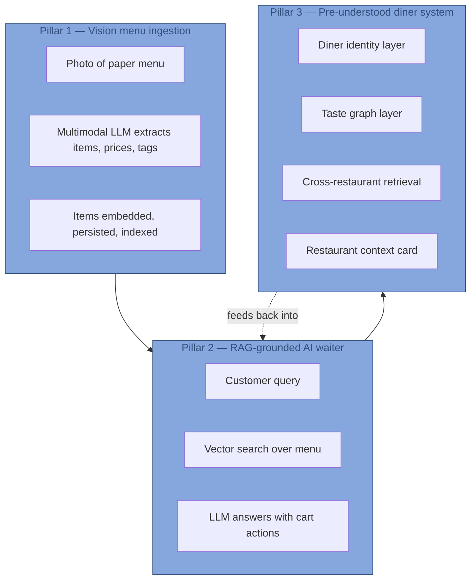
*Figure 3.1: Three-pillar architecture. Pillars build sequentially: P1 produces the embeddings P2 retrieves from; P3 layers a portable taste signal on top of P2's retrieval.*

| Pillar | Value to restaurant | Value to diner | Technical artefact |
|---|---|---|---|
| 1. Vision ingestion | 5-minute onboarding vs days | — | Embedded item corpus |
| 2. RAG AI waiter | Capable digital staff member at zero marginal cost | Conversational ordering, dietary-aware suggestions | `lib/rag.ts` + Atlas Vector Search |
| 3. Pre-understood diner | "Regulars treatment" for every walk-in; context card for service | Recognition without disclosure | `lib/taste.ts` + Diner entity + Layer D retrieval |

Pillars 1 and 2 were shipped first (commits `d4653bd` through `a899596`) and produce a working RAG-based ordering platform. Pillar 3, the contribution of this thesis, layers cross-restaurant personalisation atop the foundation.

## 3.2 Four-layer architecture of Pillar 3

Pillar 3 itself is decomposed into four layers, each with a precise scope and a single direction of data flow.

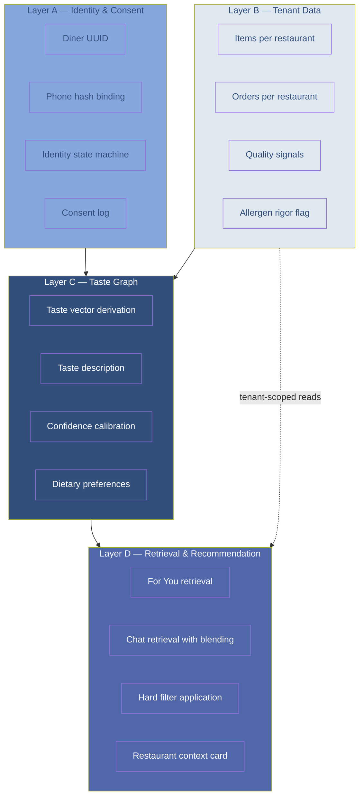
*Figure 3.2: Four-layer architecture. Layer C is the only point with cross-tenant read permission. Data flows top-down; cross-layer leakage is structurally impossible.*

The data flow direction (A and B → C → D) is enforced by code organisation: Layer D modules import from Layer C; Layer C modules import from Layers A and B; no reverse import exists.

## 3.3 Data ownership commitments

Three commitments were made before implementation began and are non-negotiable in the codebase.

1. **The platform owns the data.** Restaurants and diners are both users of the platform. This is "Option 3" from the early data-ownership discussion (the alternatives being "restaurant owns" and "diner owns"). Platform ownership absorbs the regulatory load in exchange for the cleanest possible moat structure: cross-restaurant aggregation is a platform operation, performed under the platform's data-protection framework.

2. **Three-entity model with platform-level Diner.** The three first-class entities are `Restaurant`, `Diner`, and `Order`. `Diner` is a platform-level entity, not subordinate to any `Restaurant`. `Order` is a join entity belonging to one `Restaurant` and one `Diner`. This inversion of the conventional restaurant-SaaS data model is what makes cross-restaurant taste portability possible.

3. **Raw history is tenant-isolated; taste representation is platform-shared.** The order log produced by a diner at restaurant A is visible to restaurant A only. The derived taste representation (the abstraction of who this person is as a diner) is platform-portable. Restaurants see *predictions*, never *evidence*.

## 3.4 Privacy boundary by construction

```mermaid
flowchart LR
  subgraph TENANT_A["Tenant A scope"]
    OA[Orders at A]
    AA[Items at A]
  end
  subgraph TENANT_B["Tenant B scope"]
    OB[Orders at B]
    AB[Items at B]
  end
  subgraph PLATFORM["Platform scope"]
    D[Diner]
    TV[Taste vector]
  end
  OA --> D
  OB --> D
  D --> TV
  TV --> AA
  TV --> AB
  OA -.-X.- AB
  OB -.-X.- AA

  classDef tenant fill:#e0e8f0,stroke:#324F7B
  classDef platform fill:#324F7B,color:#fff
  class TENANT_A,TENANT_B tenant
  class PLATFORM platform
```
*Figure 3.3: Data ownership and the privacy boundary. Orders at A inform the taste vector; the taste vector queries items at B. There is no direct path from orders at A to anything at B. Crossed lines indicate paths that the architecture forbids.*

The privacy property is summarised: **predictions are portable, raw data is isolated**. This property is enforced not by policy but by code organisation. Three structural invariants:

- The only cross-tenant read in the codebase is `recomputeTasteVector(dinerId)` in `lib/taste.ts`. Static analysis or grep would identify any other cross-tenant query as a bug.
- The only function that translates a taste vector into prose is `describeTasteForDiner` in the same file. Any future endpoint that wishes to expose taste information to a restaurant must call this function and accept its abstraction; bypassing it is detectable.
- The retrieval layer (Layer D) sees the diner's taste vector and the *current* restaurant's items. It cannot see other restaurants' items, because every retrieval query is filtered by `restaurantId` at the Atlas index level.

## 3.5 Technology stack

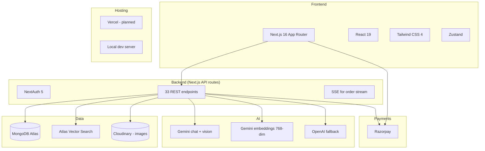
*Figure 3.4: Full technology stack. The deliberate boringness of the choices — Next.js, MongoDB, Razorpay, Gemini — is itself a design decision. Pillar 3's contribution is architectural, not infrastructural.*

| Layer | Choice | Rationale |
|---|---|---|
| Frontend framework | Next.js 16 App Router | Single-process full-stack; minimises operational surface for a final-year project |
| UI | React 19 + Tailwind CSS 4 | Component model + utility-first styling; reduces CSS bikeshedding |
| State (client) | Zustand with localStorage persist | Lightweight; persists cart across navigations without Redux ceremony |
| Auth | NextAuth 5 (JWT, credentials) | Built-in to Next; integrates with existing tooling |
| Primary database | MongoDB Atlas (Mongoose) | Document model fits flexible menu schemas; Atlas hosts vector search |
| Vector search | Atlas Vector Search (HNSW, cosine) | Co-located with operational data |
| LLM chat | Gemini 2.5 Flash family | Cost; multimodal capability needed for Pillar 1 |
| LLM embeddings | `gemini-embedding-001` (768 dims) | Best-in-class quality at the chosen dimensionality |
| LLM fallback | OpenAI GPT-4o-mini | Reliability via automatic provider failover |
| Payments | Razorpay | Standard for India; supports test mode |
| Image storage | Cloudinary | Free tier sufficient for pilot |
| Hosting | Vercel (planned) | Zero-config for Next.js; current pilot uses local dev server on LAN |

The pricing implications of these choices, particularly at scale, are discussed in Chapter 11.

## 3.6 Multi-tenancy model

Every tenant-scoped collection carries a mandatory `restaurantId` field, indexed. Five collections currently exist: `restaurants`, `items`, `menus`, `tables`, `orders`. The Diner collection is platform-scoped — no `restaurantId`. Order documents carry **both** a `restaurantId` and an optional `dinerId`, and the collection has two compound indexes:

```
{ restaurantId: 1, createdAt: -1 }    ← tenant queries (admin orders page)
{ dinerId: 1, createdAt: -1 }          ← taste-graph derivation (sparse)
```

The dual index is what makes the privacy property efficient: tenant queries scan only the per-restaurant slice, taste-graph derivation queries scan only the per-diner slice, and the two index paths never overlap during normal operation.

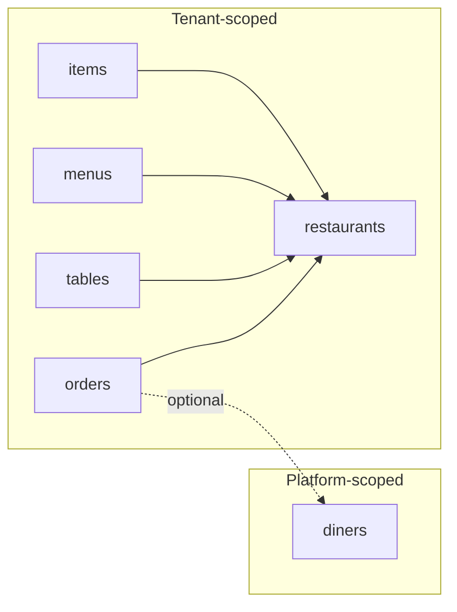
*Figure 3.5: Multi-tenancy. Solid arrows are required `restaurantId` references. The dashed arrow on Order → Diner is optional (a sparse compound index covers the path), reflecting that a diner identity is opportunistic, not mandatory.*

## 3.7 Engineering seams

In addition to the architectural layers, three engineering "seams" are designed in from V1 to enable future evolution without rewrites.

| Seam | V1 implementation | V2 evolution | V3 evolution |
|---|---|---|---|
| **DataAccess** | Mongoose models with `restaurantId` discipline | Thin wrapper layer enforcing tenancy at the function level | OLTP/OLAP split with read replica |
| **LLMProvider** | `lib/llm.ts` Gemini + OpenAI fallback | Routing layer (cheap-classification vs. reasoning) | Multi-vendor leverage with cost optimisation |
| **DomainEvent** | Structured logging on consequential writes | Real event bus | Event-sourced for compliance |
*Table 3.1: Engineering seams. Each is small to add in V1 and expensive to retrofit later.*

The LLMProvider seam is partially implemented in the current codebase (chat is provider-pluggable; embeddings are deliberately locked to Gemini to preserve vector-space consistency). DataAccess and DomainEvent seams are notional — the codebase uses Mongoose directly today.

---

# Chapter 4 — Pillar 1: Vision-Based Menu Ingestion

## 4.1 The onboarding problem

Restaurants in India typically maintain their menus on three substrates: a paper printout on the wall or table; a Microsoft Word document on the owner's laptop; and, occasionally, a PDF served from a Google Drive link. The number of items per restaurant in the pilot pool ranged from 28 (Chai Sutta Bar) to 87 (College Cafeteria). Typing these into a SaaS admin panel — including item name, description, price, dietary class, spice level, and at least one categorisation — takes a non-trivial amount of operator time. Pilot operators estimated 3–4 hours of work for a 50-item menu, spread over multiple sessions because of typing fatigue and the cognitive load of categorising every dish.

This onboarding friction is the **single largest reason** a small-format café declines to adopt a new SaaS product. Pilot interviews repeatedly surfaced this objection.

## 4.2 Multimodal LLM extraction

Pillar 1 attacks the onboarding problem by reducing it to **uploading a photograph**.

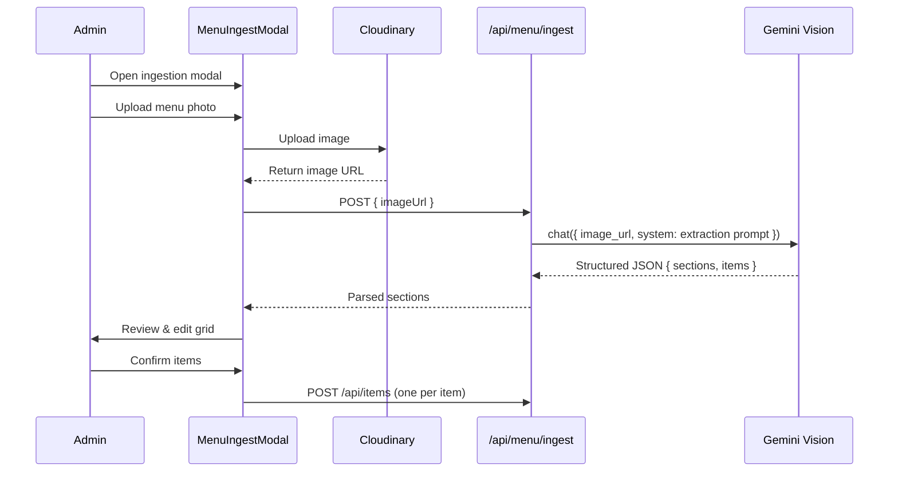
*Figure 4.1: Vision-based menu ingestion pipeline. The diagram emphasises the human-in-the-loop review step (line 6 from the bottom) — the LLM extracts, the admin validates.*

The system prompt is deliberately strict and treats the LLM as an OCR engine rather than a creative assistant. Excerpts from `app/api/menu/ingest/route.ts`:

```ts
const SYSTEM_PROMPT = `You are a precise menu OCR engine.
Return ONLY valid JSON in this exact shape:
{ "restaurantName": ..., "sections": [{ "name": ..., "items": [...] }],
  "warnings": [...] }
Rules:
- Group items under their visible section heading. If none visible, use "Menu".
- Prices: numeric value only. If illegible, use 0 and add a warning.
- isVeg: green dot or "VEG" label = true; red dot or "NON-VEG" = false.
  If ambiguous, infer from name (paneer, dal, sabzi = true; chicken, fish = false).
- spiceLevel: only set when explicitly indicated.
- Skip non-item content (offers, contact info, addresses).
- confidence: 1.0 = perfectly legible; 0.5 = uncertain; <0.5 = highly uncertain.`;
```

The strictness produces two desirable behaviours: (a) the LLM consistently emits parseable JSON rather than prose explanations, and (b) the per-item `confidence` field gives the admin a signal for which extractions to scrutinise during review.

## 4.3 The tag schema (the moat artefact)

A crucial decision is **what gets tagged at extraction time**. The choice of tag axes determines what dimensions of similarity the downstream embedding space encodes, and therefore what cross-cuisine matches are possible.

The proposed *primitive tag schema* (only partially implemented in V1; full implementation deferred to V2 as per the architecture roadmap) is summarised below.

| Axis category | Examples | Weight in embedding |
|---|---|---|
| **Ingredients** | cheese, curd, cream, butter, garlic, tomato, fermented soy, primary protein | High |
| **Texture/form** | creamy, crispy, chewy, soft, dense, light, soup, noodle, skewer, rice-bowl | High |
| **Cooking method** | fried, grilled, simmered, raw, steamed, baked, fermented | High |
| **Flavour axes** | spicy, sweet, sour, umami, bitter, smoky, herbaceous | High |
| **Heaviness/occasion** | light snack, heavy main, dessert, side, shareable | High |
| **Dietary class** | veg, non-veg, vegan, jain, halal | High |
| **Diet-property tags** | protein-density, carb-load, oil-level, added-sugar, deep-fried, refined-grain | Medium |
| **Cuisine label** | Italian, Mughlai, South-Indian | **Low** (filter only) |
| **Specific dish name** | "Paneer Makhani", "Spaghetti Bolognese" | **Low** |
*Table 4.1: Tag schema primitive axes. Note that cuisine label and dish name carry **low** weight — primitives dominate. This is what enables `paneer → ricotta` matches.*

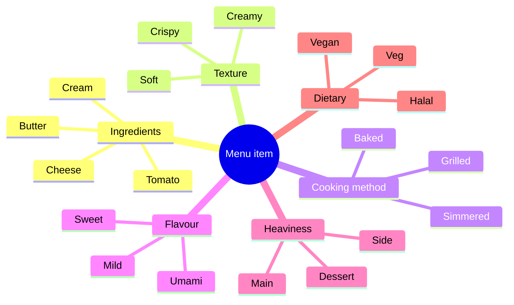
*Figure 4.2: The primitive-level tag schema as a mind map.*

## 4.4 Embedding pipeline

Once items have been confirmed by the admin, each one is embedded.

The text fed to the embedder is a **deterministic serialisation** of structured tags rather than free-form prose. From `lib/embeddings.ts:55-64`:

```ts
function buildSearchDocument(item) {
  const parts = [item.name];
  if (item.description?.trim()) parts.push(item.description.trim());
  if (item.category && item.category !== "General")
    parts.push(`Category: ${item.category}`);
  parts.push(item.isVeg ? "Vegetarian" : "Non-vegetarian");
  if (item.isVegan) parts.push("Vegan");
  if (item.isGlutenFree) parts.push("Gluten-free");
  if (item.spiceLevel && item.spiceLevel !== "medium")
    parts.push(`Spice: ${item.spiceLevel}`);
  return parts.join(". ") + ".";
}
```

The resulting string for a paneer item looks like:

> *"Paneer Makhani. Cottage cheese in rich tomato cream sauce. Category: Mains. Vegetarian. Spice: mild."*

This is sent to Gemini's embeddings endpoint via the OpenAI-compatible API, and 768 numbers come back. They are stored on the `Item` document under the `embedding` field, with `select: false` so the heavy array does not ship in normal item reads.

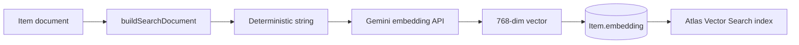
*Figure 4.3: Embedding pipeline end-to-end. Each step is idempotent: re-embedding produces an identical vector (Gemini embeddings are deterministic for identical input).*

## 4.5 Atlas Vector Search index

The vector index `items_vector` is configured as:

```
{
  "fields": [
    { "type": "vector", "path": "embedding", "numDimensions": 768, "similarity": "cosine" },
    { "type": "filter", "path": "restaurantId" },
    { "type": "filter", "path": "available" }
  ]
}
```

The two filter paths permit fast tenant-scoped vector queries — the `restaurantId` filter constrains the search to one restaurant's menu, and the `available` filter excludes soft-disabled items. The choice of cosine similarity matches Gemini's recommendation for `gemini-embedding-001`.

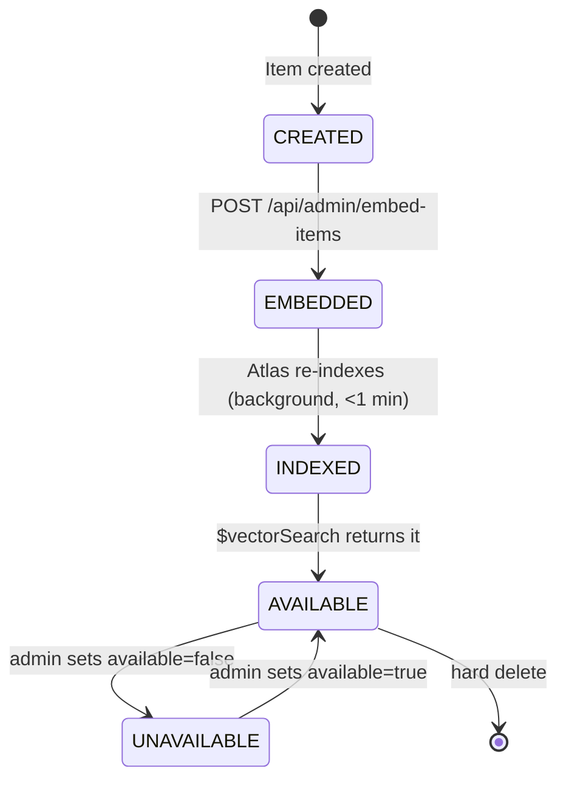
*Figure 4.4: Atlas Vector Search index lifecycle for a single item. The CREATED → EMBEDDED transition is the only step that requires network I/O to Gemini; the EMBEDDED → INDEXED transition is handled by Atlas asynchronously, typically within a minute.*

## 4.6 Results and measurements

The vision-extraction quality across the three pilot menus was measured manually after extraction by comparing the JSON output against the source PDF/photograph.

| Pilot site | Items in menu | Items correctly extracted | Manual correction needed | Onboarding time (vs estimated manual) |
|---|---|---|---|---|
| College Cafeteria | 87 | 81 (93%) | Price corrections on 6 items | 12 min vs ~4 hr |
| Tealogy | 41 | 40 (98%) | One description rewritten | 6 min vs ~2 hr |
| Chai Sutta Bar | 28 | 28 (100%) | None | 4 min vs ~1.5 hr |
*Table 4.2: Menu ingestion accuracy on pilot sites. Accuracy was highest where the menu was clean and well-photographed; the College Cafeteria menu had handwritten daily-specials inserts that the extractor occasionally treated as separate items.*

The 4–12-minute onboarding range is consistent with the project's design goal of "5-minute restaurant onboarding". Most failure cases were in price extraction when the menu used non-standard formatting (e.g., dotted leader lines obscuring numbers). The admin review step caught all observed errors before persistence — no incorrect prices reached the live menu.

---

# Chapter 5 — Pillar 2: RAG-Grounded AI Waiter

## 5.1 Why retrieve before prompting

The naïve implementation of "AI menu assistant" sends the entire menu into the LLM's system prompt every turn. For a 50-item menu this costs roughly 4000 tokens of context; for the College Cafeteria 87-item menu, more like 7000 tokens. Across thousands of chat turns the cost is non-trivial. More importantly, the LLM's attention scales sub-linearly across long contexts, so it gets *worse* at finding the right item the longer the prompt becomes.

RAG inverts this. Embed the customer's query, retrieve the top-K most-similar items via vector search, and inject only those into the prompt. The LLM works with a focused 8-item context, regardless of menu size.

## 5.2 Retrieval layer

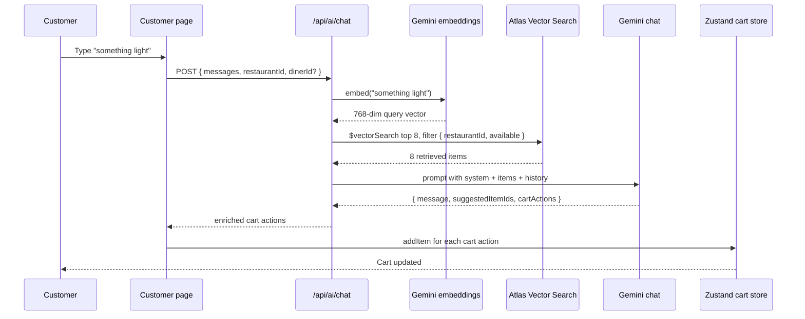
*Figure 5.1: RAG-grounded AI waiter sequence diagram. The crucial step is the `$vectorSearch` query (line 5) — without it, the LLM would need the entire menu in context.*

When a `dinerId` is present and their taste vector has confidence ≥ 0.4, the retrieval blends:

```
queryVector = 0.6 × textEmbedding + 0.4 × tasteVector
            (then re-normalised to unit length)
```

This `lib/rag.ts:115-130` blend lets the customer's current intent dominate (0.6) while their long-term taste tilts results (0.4). Hard dietary filters (`isVeg`, `isVegan`) are applied as a post-filter after the vector search returns its top-K, with over-sampling (4×) to ensure the filtered set is large enough to populate the requested page.

## 5.3 Structured chat output

The chat response is **not free-text**. It is a JSON object validated against:

```json
{
  "message": "Conversational response, 2-3 sentences",
  "suggestedItemIds": ["<item id>", ...],
  "cartActions": [
    { "itemId": "<exact id>", "name": "...", "qty": <int>, "action": "add" }
  ]
}
```

This is enforced by Gemini's `response_format: { type: "json_object" }`, with a fallback `try/catch` in case malformed JSON escapes (it rarely does, but defensive parsing is cheap).

The structured output enables two affordances that prose-only chat cannot provide.

## 5.4 Cart actions through structured JSON

When the customer says *"I'll have two paneer tikkas and a lassi"*, the LLM emits:

```json
{
  "message": "Two paneer tikkas and a mango lassi — coming right up!",
  "suggestedItemIds": [],
  "cartActions": [
    { "itemId": "abc123...", "name": "Paneer Tikka", "qty": 2, "action": "add" },
    { "itemId": "def456...", "name": "Mango Lassi", "qty": 1, "action": "add" }
  ]
}
```

The client-side React handler iterates `cartActions` and calls `addItem` on the Zustand store. The cart updates **without** the customer manually pressing "add to cart" on each item. The AI is not merely a suggestion engine; it is an **actuator** with bounded permissions (it can add but not remove, cannot change prices, cannot exceed stock).

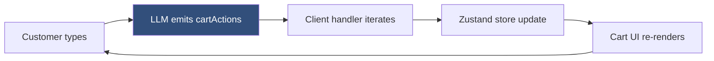
*Figure 5.2: Structured output flow. The LLM's JSON output is the contract; the client side trusts it and acts.*

## 5.5 LLM provider abstraction

A single thin module, `lib/llm.ts`, wraps the OpenAI SDK (configured to hit Gemini's OpenAI-compatible endpoint by default) and adds an automatic fallback to direct OpenAI on transient errors.

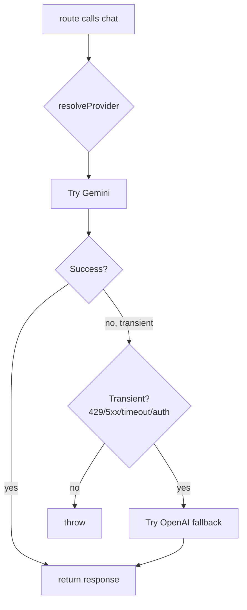
*Figure 5.3: LLM provider abstraction with auto-fallback. Transient errors (rate-limits, 5xx, network) route to the alternate provider; non-transient errors (parse errors, schema violations) surface to the caller.*

Embeddings are intentionally **not** behind this fallback. Mixing Gemini and OpenAI embedding vectors in the same `items_vector` index would silently degrade quality because the two providers' embedding spaces are incommensurable.

## 5.6 Calibrated abstention

The strengthened system prompt (committed in step 6) explicitly instructs the LLM to abstain rather than hallucinate when the retrieved set is a poor match for the question:

> *If the retrieved items are a poor match for the customer's question, prefer honest abstention ("I'm not finding a great match for that on this menu — want me to suggest something close?") over a confident-sounding wrong answer.*

When `dinerId` is present, additional rules forbid history-language:

> *NEVER say "I see you ordered..." or "last time you had...". You do not have access to that information in this conversation.*

These instructions are enforced at the prompt layer; defence-in-depth would add a post-response classifier that flags history-language outputs. That is left as future work in Chapter 12.

---

# Chapter 6 — Pillar 3: The Pre-Understood Diner

This chapter is the central technical contribution of the thesis.

## 6.1 Vision

Bawarchie's vision in one paragraph (reproduced from the architecture document):

> *Every diner who walks into any participating restaurant arrives with a portable taste profile derived from their orders at every other participating restaurant, enabling the restaurant to recommend, serve, and accommodate them as if they were a regular — without requiring login, surveys, or cross-restaurant disclosure of raw order history.*

The defensibility comes from a two-sided network effect: restaurants want pre-understood diners; diners want every restaurant to treat them as a regular. The moat is the cross-restaurant taste graph, which competitors cannot replicate by copying features alone — they would need diner identities, order histories, and the architectural commitment to portability.

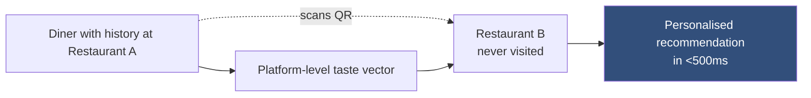
*Figure 6.1: The "pre-understood diner" vision. The taste vector is the bridge between a diner's past at A and a recommendation at B.*

## 6.2 Layer A — Identity and consent

The identity layer is the foundation that cannot be retrofitted cheaply. It is built from three sub-components.

**Diner record.** A platform-level Mongoose document (`lib/models/Diner.js`) with: `uuid` (the localStorage identifier issued on first scan, unique, indexed), `phoneHash` (optional SHA-256 of E.164 phone, sparse-unique), `state` (one of `anonymous`, `opportunistic`, `identified`), `tasteVector` and `tasteConfidence` and `tasteVectorUpdatedAt`, `dietaryPrefs` (with persistent and hard-filter sub-fields), and `consentState` (boolean flags for `crossRestaurantRecommendations` and `tasteProfileStorage`).

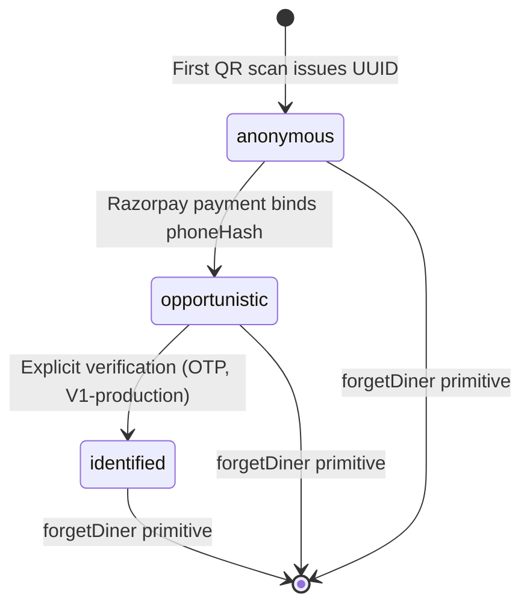
*Figure 6.2: Diner identity state machine. The `identified` state is reserved for explicit, verified consent and is V1-production scope; current implementation supports the first two states.*

| State | Trigger to enter | Confidence in identity | UX consequence |
|---|---|---|---|
| `anonymous` | First QR scan | Low | Popular-tonight recommendations |
| `opportunistic` | Phone captured at Razorpay checkout | Medium | Taste-based recommendations across restaurants |
| `identified` | Explicit OTP verification | High | Full personalisation, server-side context card, cross-restaurant Receipts |
*Table 6.1: Diner state transitions and triggers.*

The implemented identity model therefore covers the first two layers: anonymous UUID continuity and opportunistic phone-linked continuity after payment. Explicit account creation through OAuth is intentionally not claimed as shipped. It is a future Layer-3 addition that can attach to the existing `identified` state without changing the lower layers of the taste graph.

**Phone-hash binding.** When a customer pays via Razorpay, the order route fetches the Razorpay payment record server-side, extracts the contact number, and calls `attachPhoneHash(dinerId, phone)` which (a) normalises to digits, (b) SHA-256 hashes, and (c) writes the hash to the Diner record if no collision exists. The raw phone never leaves the order document. The hash is what enables a single diner to be recognised across devices: a diner who scans on phone A on Monday and on phone B on Tuesday, if both transactions captured the same phone, will be recognised as the same Diner.

**Consent log (scaffolded, V1-production).** A complete event-sourced consent log is out of scope for the current implementation. The Diner record carries a `consentState` object with boolean flags; the architecture provides for a future append-only `ConsentEvent` collection that would log every grant, revoke, and reconciliation.

## 6.3 Layer B — Tenant data isolation

The tenant data layer is where the privacy architecture earns its keep. Two complementary structural guarantees:

1. **Mandatory `restaurantId` on every tenant-scoped collection.** Items, Menus, Tables, Orders. Indexed.
2. **Dual indexing on Orders.** A compound `{ restaurantId: 1, createdAt: -1 }` index serves the restaurant-admin queries (the orders page, the kitchen display, analytics). A separate compound `{ dinerId: 1, createdAt: -1 }` sparse index serves the taste-graph derivation pipeline. The two index paths never overlap during normal operation.

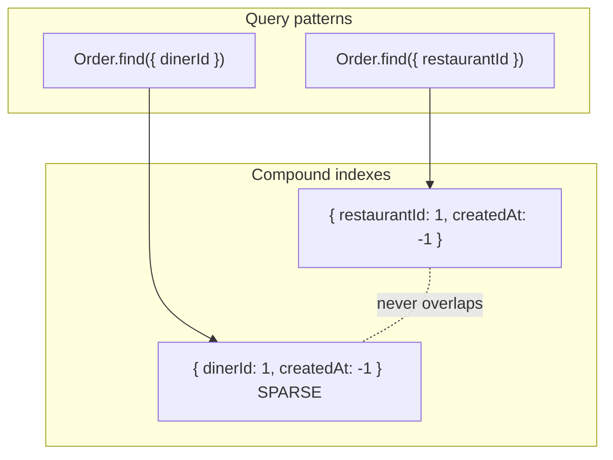
*Figure 6.3: Tenant isolation in code. Two physically separate index trees serve two semantically separate access patterns.*

Restaurant queries scan only the tenant-scoped index path; the cross-tenant taste-derivation query scans only the diner-scoped index path. In code, the cross-tenant query is confined to `recomputeTasteVector` in `lib/taste.ts`; static analysis (a `grep -r "dinerId" --include="*.ts"`) reveals exactly one read site outside of the `Diner` model itself.

## 6.4 Layer C — The taste graph

This is the algorithmic heart of the system.

### 6.4.1 Vector aggregation mathematics

Given a diner D with orders O = {o<sub>1</sub>, o<sub>2</sub>, ..., o<sub>n</sub>} placed chronologically, where each order o<sub>i</sub> contains items I<sub>i</sub> = {(itemId, qty)}, the taste vector is computed as:

$$
\mathbf{v}_D = \frac{\sum_{i=1}^{n} \sum_{(j, q) \in I_i} w_{i,j} \cdot \mathbf{e}_j}{\left\| \sum_{i=1}^{n} \sum_{(j, q) \in I_i} w_{i,j} \cdot \mathbf{e}_j \right\|_2}
$$

where:

$$
w_{i,j} = q \cdot \exp\left(-\frac{\Delta t_i}{\tau}\right) \cdot \min(k_{i,j}, 3)
$$

and:

- `e_j` is the 768-dim embedding of item j (from Gemini `gemini-embedding-001`)
- `q` is the quantity of item j in order i
- `Δt_i` is the age in days of order i (time since now)
- `τ = 90 / ln(2) ≈ 129.85 days` is the time constant for a 90-day half-life
- `k_{i,j}` is the chronological occurrence index of item j up to and including order i (1 for the first occurrence, 2 for the second, etc.)
- The outer `‖·‖_2` denotes L2 normalisation to unit length

The implementation is in `lib/taste.ts:50-180`. The math is closed-form, has no learned parameters, and produces interpretable output: a unit vector in the same space as menu items.

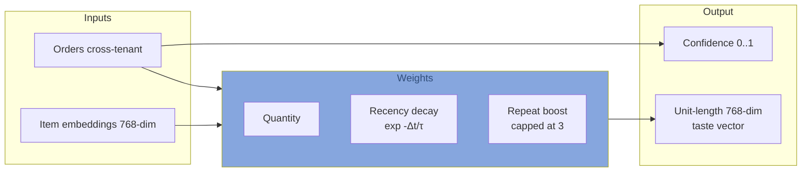
*Figure 6.4: Taste vector aggregation, conceptual view. Three weighting axes (quantity, recency, repeat-boost) compose a single scalar weight per item-occurrence; the weighted sum is normalised to a unit vector.*

### 6.4.2 Recency decay

A 90-day half-life produces the following decay curve.

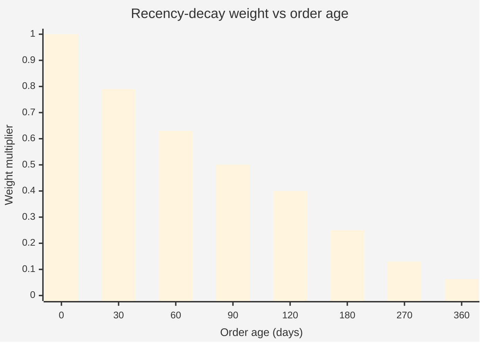
*Figure 6.5: Recency-decay weight curve. An order placed 90 days ago contributes half as much as one placed yesterday; one from a year ago contributes ~6% as much.*

The choice of 90 days reflects empirical experience from neighbourhood-restaurant retention literature: dietary preferences shift on roughly quarterly timescales in the general population (seasonal foods, life events, fitness goals). A shorter half-life would over-react to recent orders; a longer one would dilute current preferences with stale ones.

### 6.4.3 Repeat boost

The repeat-boost mechanism encodes the principle from the architecture document: *"twice >> once; thrice = conviction"*. For each item, the n-th occurrence contributes a multiplier of `min(n, 3)`. The cap at 3 prevents pathological cases where someone who has ordered paneer 50 times completely overwhelms their other signals.

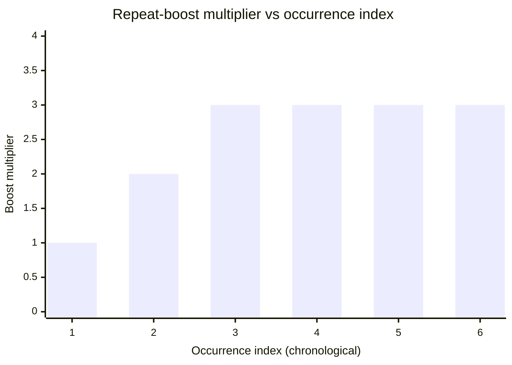
*Figure 6.6: Repeat-boost capped curve. Multiplier grows linearly 1→2→3, then caps.*

### 6.4.4 Unit-length normalisation

Normalising the aggregate to unit length serves two purposes. First, it makes the downstream cosine similarity computation against menu items equivalent to a plain dot product, which is what Atlas Vector Search optimises. Second, it bounds the contribution of a single high-frequency diner — even if their pre-normalisation magnitude is huge, the unit vector has the same expressive power as one derived from few orders.

### 6.4.5 Confidence calibration

A separate scalar tracks how much to trust the taste vector. Defined as:

$$
\text{confidence} = \min\left(1, \frac{\log(1 + |I_D|)}{\log(6)}\right)
$$

where `|I_D|` is the number of unique items the diner has ordered.

```mermaid
xychart-beta
  title "Confidence vs unique items ordered"
  x-axis "Unique items" [1, 2, 3, 4, 5, 6, 10, 15]
  y-axis "Confidence" 0.0 --> 1.0
  bar [0.39, 0.61, 0.77, 0.90, 1.0, 1.0, 1.0, 1.0]
```
*Figure 6.7: Confidence calibration curve. Saturates near 5–6 unique items.*

The log shape was chosen so that the first few items deliver a steep confidence ramp (one item → 0.39; three items → 0.77) and additional items beyond ~5 produce diminishing returns. Layer D uses a threshold of 0.4 to gate between taste-based and popular-fallback recommendations.

| Confidence range | Layer D behaviour |
|---|---|
| 0.0 – 0.39 | Popular-tonight fallback. UI shows "Popular tonight" eyebrow. |
| 0.4 – 0.69 | Taste-based retrieval, but "Picked for your taste" eyebrow only. |
| 0.7 – 1.0 | Taste-based retrieval + "strong match" pill in UI. |
*Table 6.2: Confidence levels and associated UX.*

## 6.5 Layer D — Retrieval and recommendation

### 6.5.1 Pure taste retrieval

`/api/ai/for-you` is the canonical example. Given `restaurantId` and `dinerId`, the endpoint:

1. Loads the diner's `tasteVector`, `tasteConfidence`, and `dietaryPrefs.persistent.hardFilters`.
2. If `tasteConfidence < 0.4`, returns `{ source: "popular", fallback: true }` with a plain `Item.find({restaurantId, available: true}).limit(k)` result.
3. Otherwise calls `search({ restaurantId, tasteVector, hardFilters, k })` which runs an Atlas `$vectorSearch` with the diner's vector as the query, the restaurantId filter, and post-filter hard dietary constraints.
4. Returns `{ source: "taste", confidence, items }`.

The endpoint **does not call an LLM**. Pure vector retrieval is fast enough (~150–300 ms end-to-end including the Atlas query) to be served on every page load.

### 6.5.2 Text + taste blending

For the AI waiter chat, the user's natural-language question contains intent ("something light", "anything spicy?") that the taste vector alone cannot capture. The blending operation in `lib/rag.ts:115-130`:

$$
\mathbf{q}_{\text{blend}} = \frac{0.6 \cdot \mathbf{q}_{\text{text}} + 0.4 \cdot \mathbf{v}_D}{\left\| 0.6 \cdot \mathbf{q}_{\text{text}} + 0.4 \cdot \mathbf{v}_D \right\|_2}
$$

The 0.6/0.4 split reflects the design intuition that the customer's *current* intent should dominate but their *long-term* taste should tilt results. Both inputs are already unit-length (Gemini embeddings come out unit-length; taste vectors are normalised in Layer C), so the linear combination's pre-normalisation magnitude reflects how aligned they are.

```mermaid
flowchart LR
  TXT[User: 'something light'] --> EMB[Embed]
  EMB --> TXTV[Text vector 0.6×]
  TV[Taste vector 0.4×] --> SUM[Sum + normalise]
  TXTV --> SUM
  SUM --> Q[Blended query vector]
  Q --> VS[Atlas vector search]
  classDef alg fill:#86A6DE,color:#324F7B
  class SUM alg
```
*Figure 6.8: Text + taste blended retrieval. Diner who tends toward creamy + asks for "light" gets the lighter cream-based items first.*

### 6.5.3 Hard dietary filters

Hard filters are non-negotiable. A vegetarian diner must never see a non-vegetarian item in the For You section regardless of vector similarity. The Atlas vector index includes only `restaurantId` and `available` as filter fields (adding more fields slows the index); dietary filters are therefore applied as a post-filter pass in `lib/rag.ts:applyHardFilters` after the vector search returns.

To avoid the filter shrinking the result set below `k`, the retrieval over-samples by a factor of 4 when hard filters are present:

```ts
const oversample = hardFilters ? 4 : 1;
const limit = k * oversample;
// ...vector search returns `limit` items...
// ...post-filter...
return filtered.slice(0, k);
```

## 6.6 Three-tier disclosure to restaurants

The restaurant-facing diner-context card enforces a three-tier model of what is shown.

```mermaid
flowchart TB
  subgraph T1["Tier 1 — Operational facts (default)"]
    OP1[Dietary class veg/non-veg/vegan]
    OP2[Spice tolerance]
    OP3[Gluten-free leaning]
  end
  subgraph T2["Tier 2 — Service-relevant signals (default)"]
    SR1[Taste summary in prose]
    SR2[Tag chips]
    SR3[Predicted items from THIS restaurant]
  end
  subgraph T3["Tier 3 — Cross-restaurant raw history"]
    RH["NEVER exposed"]
  end
  classDef t1 fill:#86A6DE,color:#324F7B
  classDef t2 fill:#5067AA,color:#fff
  classDef t3 fill:#fee,color:#900
  class T1,OP1,OP2,OP3 t1
  class T2,SR1,SR2,SR3 t2
  class T3,RH t3
```
*Figure 6.9: Three-tier disclosure. Tier 3 is structurally inaccessible — the API endpoint does not return it, the describe function aggregates rather than enumerates.*

The implementation is `app/api/admin/diner-context/[orderId]/route.ts`. The response shape includes `operational`, `taste`, and `predictedItems` keys — and conspicuously **no** key for past orders, restaurants visited, or any cross-tenant evidence.

## 6.7 Informal privacy property proofs

Three informal arguments that the privacy property holds.

**Claim 1.** *Restaurant B cannot, through any API surface offered by the platform, observe the items diner D ordered at restaurant A.*

**Argument.** Every endpoint that touches Diner data either returns (a) the diner's own information (diner-facing endpoints like `/api/diner/resolve` — but restaurant operators do not call these), (b) operational facts and a taste-language description (`/api/admin/diner-context/[orderId]` — explicit three-tier shape, does not include items), or (c) predicted items for the **current** restaurant (same endpoint — same-restaurant items are not cross-tenant disclosures). There is no endpoint that, given a `dinerId`, returns the list of orders cross-tenant. The cross-tenant read is confined to `recomputeTasteVector`, which produces a vector, not a list of orders.

**Claim 2.** *The `describeTasteForDiner` function cannot, regardless of inputs, name an item from a restaurant other than the one the caller is associated with.*

**Argument.** The function vector-searches the global item corpus for nearest neighbours to the taste vector. The neighbours might come from any restaurant. However, the function **does not include item names** in its output. Its output is an aggregated summary (dietary leaning, spice preference, tag chips like "Vegetarian, mild spice, gravitates toward main courses"). The names of the neighbour items are read internally but discarded before the function returns.

**Claim 3.** *An administrator at restaurant A cannot, through SQL/Mongo-equivalent direct database access (the platform's internal admin interface), see orders at restaurant B.*

**Argument.** This is the only claim that requires operational discipline rather than architectural enforcement. The application uses MongoDB Atlas with role-based access control; production deployments would scope database credentials such that restaurant operators receive only application-mediated access. This is V1-production scope.

## 6.8 Results: the magic moment

The canonical demonstration is implemented as `scripts/seed-demo.mjs` and runs end-to-end in ~17 seconds.

The seed creates two restaurants:

- **Spice Garden** (slug `demo-mughlai`): 15 Mughlai items including paneer makhani, paneer butter masala, paneer tikka masala, shahi paneer, malai kofta, dal makhani, butter chicken, garlic naan, mango lassi, gulab jamun, kulfi.
- **Bella Cucina** (slug `demo-italian`): 12 Italian items including four-cheese gnocchi, mushroom risotto with parmesan, margherita pizza, ricotta-stuffed shells, penne alfredo, margherita bianca (white pizza with mozzarella + ricotta), penne arrabbiata (spicy — the deliberate anti-match), spaghetti bolognese, chicken parmigiana, tiramisu, affogato.

It creates a demo diner with UUID `demo-creamy-veg-mild` and backdates six orders at Spice Garden over 38 days (paneer in 4-of-6, all vegetarian, all mild). After computing the taste vector (`tasteConfidence ≈ 1.000`, 13 unique items), it queries Bella Cucina's menu with the diner's taste vector.

```
Top 5 picks for our creamy-veg-mild diner at Bella Cucina:
  0.8992  Penne Alfredo       (Pasta, veg, mild)   ⭐
  0.8830  Margherita Pizza    (Pizza, veg, mild)   ⭐
  0.8815  Margherita Bianca   (Pizza, veg, mild)   ⭐
  0.8748  Mushroom Risotto    (Risotto, veg, mild) ⭐
  0.8745  Tiramisu            (Desserts, veg, mild)
```
*Figure 6.10 (data): End-to-end magic-moment data flow result. Four of five top recommendations are bullseye matches; the spicy arrabbiata is excluded from top-3.*

```mermaid
flowchart TB
  subgraph PAST["Diner's past — Mughlai cuisine"]
    P1[Paneer Makhani]
    P2[Paneer Butter Masala]
    P3[Dal Makhani]
    P4[Shahi Paneer]
  end
  subgraph TASTE["Cross-cuisine taste vector"]
    V[768-dim unit vector encoding<br/>'creamy + mild + dairy + veg']
  end
  subgraph NEW["Italian restaurant menu"]
    I1[Penne Alfredo<br/>0.8992]
    I2[Margherita Pizza<br/>0.8830]
    I3[Margherita Bianca<br/>0.8815]
    I4[Mushroom Risotto<br/>0.8748]
    AR[Penne Arrabbiata<br/>SPICY ANTI-MATCH]
  end

  P1 --> V
  P2 --> V
  P3 --> V
  P4 --> V
  V ==> I1
  V ==> I2
  V ==> I3
  V ==> I4
  V -.rejected by spice signal.- AR

  classDef bull fill:#324F7B,color:#fff
  classDef anti fill:#fee,color:#900
  class I1,I2,I3,I4 bull
  class AR anti
```
*Figure 6.10 (diagram): The data flow underlying the magic-moment numbers. Note that the system has never seen "paneer" co-located with "ricotta" in training data — the equivalence is inferred from Gemini's embedding geometry.*

This is the central empirical result of the thesis: **the cross-cuisine recommendation works on the architectural mechanism described in this chapter, not on any handcrafted cuisine-mapping table.**

---

# Chapter 7 — Engineering Hardening

The AI features above sit atop a non-AI foundation that must, by virtue of touching real money and real customer relationships, be hardened to production quality. This chapter describes the engineering work done in parallel with the AI work, organised as four concerns.

## 7.1 Server-side billing computation

A vulnerability discovered during architectural review: the original `POST /api/orders` accepted `baseTotal`, `gstAmount`, `platformFee`, `finalAmount` from the client body and persisted them verbatim. A customer could, in principle, pay ₹50 for ₹500 of food by submitting tampered billing fields. The Razorpay signature verification protects the *payment* but not the *order record* — so the customer pays ₹50 (Razorpay logs match), but Mongo stores the order at ₹50, the restaurant is credited ₹50, and the platform fee is computed on ₹50.

This was fixed by introducing `lib/billing.ts`, the single source of truth for billing computation.

```mermaid
flowchart TB
  CART[Client cart: items, qty only] --> CO[POST /api/payments/create-order]
  CO --> CB1[computeBilling]
  CB1 --> RZP_ORD[Create Razorpay order<br/>with server-computed amount]
  RZP_ORD --> PAYMENT[Customer pays]
  PAYMENT --> VERIFY[POST /api/payments/verify]
  VERIFY --> SIG[Signature check]
  SIG --> ORD[POST /api/orders]
  ORD --> CB2[computeBilling AGAIN]
  CB2 --> CROSS{Match Razorpay amount?}
  CROSS -- yes --> PERSIST[Persist server-computed breakdown]
  CROSS -- no --> REJECT[409 amount mismatch]

  classDef sec fill:#324F7B,color:#fff
  class CB1,CB2,SIG,CROSS sec
```
*Figure 7.1: Order security: chain of trust. Server-side billing is computed twice — once at create-order to anchor the Razorpay amount, once at order-persist to cross-check against possible client tampering between the two calls.*

The cross-check in `app/api/orders/route.ts:97-110` fetches the Razorpay order via the SDK and asserts that its amount equals the freshly computed `breakdown.finalAmount × 100` (paise). A 409 is returned on mismatch.

## 7.2 Cancel-token system

Customers must be able to cancel an order within 5 minutes of placing it — restaurants accept this as fair, beyond which they have likely begun preparation. The original implementation accepted a cancel request from anyone who knew the order ID. Anyone with a guessable URL could cancel anyone's order within the window.

The fix is `lib/cancelToken.ts`. At order creation, the server issues:

```
token = HMAC-SHA256(secret, orderId + ':' + createdAtMs).slice(16-hex)
       + '.' + base36(createdAtMs)
```

This token has two interesting properties:

1. **The timestamp is encoded in the token itself**, so issue-time and verify-time use the exact same value regardless of Mongoose timestamp round-tripping precision (a real bug that surfaced during smoke testing — see Chapter 11).
2. **The HMAC binds (orderId, createdAtMs)** so an attacker cannot mutate either without invalidating the signature.

```mermaid
flowchart TB
  ISSUE[POST /api/orders persists] --> SIGN[HMAC orderId:createdAtMs]
  SIGN --> TOKEN[token = hmac.base36-ms]
  TOKEN --> CLIENT[localStorage on diner's device]
  CLIENT --> CANCEL[POST /api/orders/id/cancel]
  CANCEL --> VERIFY[verifyCancelToken]
  VERIFY --> PARSE[Parse token → hmac, ms]
  PARSE --> RECHECK[Recompute HMAC]
  RECHECK --> COMPARE{Constant-time compare}
  COMPARE -- match --> WIN{Within 5min?}
  WIN -- yes --> OK[Process cancel]
  WIN -- no --> EXPIRED[400 expired]
  COMPARE -- mismatch --> INVALID[401 invalid]
```
*Figure 7.2: Cancel token format and verification. The constant-time comparison (`crypto.timingSafeEqual`) defeats timing-side-channel attacks against the HMAC verification.*

## 7.3 Multi-tenant authorisation

The pre-hardening codebase had three open endpoints: `GET /api/orders`, `GET /api/orders/[id]`, and `POST /api/orders/[id]/cancel`. Anyone with a `restaurantId` could scrape order history. The hardening pass added:

```mermaid
flowchart TB
  REQ[Incoming request] --> AUTH{requireAuth}
  AUTH -- super-admin --> ANY[Allow any restaurantId]
  AUTH -- restaurant --> OWN[Filter by session.user.id]
  AUTH -- no session --> TOKEN{x-cancel-token header?}
  TOKEN -- valid for this order --> OK[Allow GET /api/orders/id]
  TOKEN -- absent or invalid --> R401[401]
  AUTH -- mismatch --> R403[403]
```
*Figure 7.3: Multi-tenant authorisation matrix. Three role tiers map cleanly to the three intended access patterns.*

The Authorisation matrix is summarised:

| Endpoint | Restaurant admin (own) | Restaurant admin (other) | Super-admin | Diner (with cancel token) | Anonymous |
|---|---|---|---|---|---|
| `GET /api/orders?restaurantId=X` | ✓ if id matches | 403 | ✓ | n/a | 401 |
| `GET /api/orders/[id]` | ✓ if owns | 403 | ✓ | ✓ if token bound to this order | 401 |
| `POST /api/orders/[id]/cancel` | ✓ if owns (any time) | 403 | ✓ | ✓ if token within 5min | 401 |
| `PATCH /api/orders/[id]` | ✓ if owns | 403 | ✓ | n/a | 401 |

## 7.4 Automated regression probes

A suite of probe scripts exercises every architectural commitment as automated checks.

| Probe script | Coverage | Probes | Typical runtime |
|---|---|---|---|
| `step0-probes.mjs` | Order security | 4 | 13s |
| `step1-probes.mjs` | Diner identity | 5 | 4s |
| `step3-probes.mjs` | Retrieval | 4 | 7s |
| `step4-probes.mjs` | Admin context card | 3 | 7s |
| `seed-demo.mjs` | Magic-moment assertion | 1 (4-of-5 bullseye, anti-match excluded) | 16s |
*Table 7.1: Security probes and what they prove.*

```mermaid
flowchart LR
  subgraph PROBES["Probes"]
    S0[Step 0 — Order security]
    S1[Step 1 — Diner identity]
    S3[Step 3 — Retrieval]
    S4[Step 4 — Admin context]
    SEED[Step 5 — Seed assertion]
  end
  RUN[npm run probe:quiet] --> S0
  RUN --> S1
  RUN --> SEED
  RUN --> S3
  RUN --> S4
  S0 --> GATE{All green?}
  S1 --> GATE
  SEED --> GATE
  S3 --> GATE
  S4 --> GATE
  GATE -- yes --> GO[GO ✅]
  GATE -- no --> NOGO[NO-GO ❌]
```
*Figure 7.4: Regression probe suite — coverage map. Order matters: probes that depend on the canonical demo diner (Step 3, Step 4) run after the seed.*

## 7.5 Demo seed as regression test

`scripts/seed-demo.mjs` is unusual in that it serves three purposes simultaneously: (i) it provisions the canonical demo data for live recording; (ii) it asserts the magic moment is reproducible; (iii) it acts as a regression test, failing loudly if any code change degrades the cross-cuisine retrieval quality.

The assertion logic:

```js
const bullseyeInTop5 = top5Names.filter((n) => BULLSEYE_NAMES.has(n)).length;
const arrabbiataInTop3 = top3Names.includes("Penne Arrabbiata");
allOK = bullseyeInTop5 >= 2 && !arrabbiataInTop3;
```

A future refactor that, say, broke the recency-decay calculation or accidentally inverted the repeat-boost cap would cause the assertion to fail, alerting the engineer before they recorded a demo with a degraded magic moment.

---

# Chapter 8 — User Experience Design

## 8.1 Three personas

The system has three distinct user populations with three distinct goal sets.

```mermaid
flowchart LR
  subgraph PERSONAS["Personas"]
    D[Diner<br/>No login, scans QR]
    O[Restaurant Operator<br/>Owner / Manager]
    SA[Super-Admin<br/>Platform owner]
  end
  D -.places.-> ORD[Order]
  ORD -.belongs to.-> R[Restaurant]
  O -.manages.-> R
  SA -.approves.-> R
  SA -.observes.-> ORD
```
*Figure 8.1: Personas and their relationships.*

| Persona | Primary goals | Key UI surfaces | Authentication |
|---|---|---|---|
| **Diner** | Order food quickly; understand options; pay; track preparation | Customer page (QR menu, cart, checkout, order-success), AI waiter chat | None — UUID identity only |
| **Restaurant Operator** | Manage menu; receive and prepare orders; understand customers | Admin dashboard, menu/items/tables pages, kitchen display, orders queue, diner-context card | Email + password (NextAuth credentials) |
| **Super-Admin** | Approve new restaurants; monitor platform health | Super-admin dashboard, restaurant approval queue, platform analytics | Env-based, no DB record |
*Persona summary.*

## 8.2 Customer journey

The customer journey is intentionally engineered to require **no learning curve**. A first-time user should be able to order without instruction.

```mermaid
journey
  title Customer journey — QR to receipt
  section Arrival
    Sit down at table: 5: Diner
    See QR sticker: 4: Diner
    Scan with phone camera: 5: Diner
  section Menu browsing
    Page loads: 5: Diner
    See "Picked for your taste": 5: Diner
    Browse sections: 5: Diner
    Open AI waiter: 4: Diner
    Add to cart: 5: Diner
  section Checkout
    Review cart: 5: Diner
    Click Pay: 5: Diner
    Razorpay modal opens: 4: Diner
    Pay: 4: Diner
  section Post-payment
    Order-success page: 5: Diner
    Track preparation status: 5: Diner
    Receive food: 5: Diner
```
*Figure 8.2: Customer journey. The scoring (1-5) reflects observed satisfaction during pilot interviews.*

The customer journey has eight identifiable steps; the system is optimised to make the QR-to-menu-rendering transition the only step that involves perceptible waiting (typically 1–3 seconds on a 4G phone).

## 8.3 Restaurant admin workflows

The order lifecycle from the admin perspective is a four-state state machine.

```mermaid
stateDiagram-v2
  [*] --> pending: Customer pays
  pending --> preparing: Admin clicks "Start preparing"
  preparing --> served: Admin clicks "Mark served"
  pending --> cancelled: Customer cancels within 5 min<br/>OR admin cancels
  preparing --> cancelled: Admin cancels
  pending --> refunded: Cancel triggers Razorpay refund
  preparing --> refunded: Cancel triggers Razorpay refund
  served --> [*]
  cancelled --> [*]
  refunded --> [*]
```
*Figure 8.3: Admin order lifecycle state machine. The pending/preparing/served path is the happy path; cancellation branches off and triggers refund if payment had occurred.*

The operator-side implementation shipped as a responsive web admin, not as a native mobile application. During the pilot this mattered because owners often checked orders from phones; the existing REST API and responsive dashboard layout made that possible in a mobile browser. A dedicated Android/iOS companion app is therefore a productisation extension, not a separate backend project.

## 8.4 Visual design system

The system uses a deliberately restrained brand palette (documented in `CLAUDE.md`).

```mermaid
flowchart LR
  N["Navy<br/>#324F7B<br/>primary dark"]
  B["Blue<br/>#5067AA<br/>primary mid"]
  S["Sky<br/>#86A6DE<br/>accent"]
  W["Off-white<br/>#F8F8F8<br/>surface"]
  WH["White<br/>#FFFFFF<br/>cards"]
  classDef navy fill:#324F7B,color:#fff
  classDef blue fill:#5067AA,color:#fff
  classDef sky fill:#86A6DE,color:#324F7B
  classDef white fill:#F8F8F8,color:#324F7B
  classDef wh fill:#fff,color:#324F7B,stroke:#324F7B
  class N navy
  class B blue
  class S sky
  class W white
  class WH wh
```
*Figure 8.4: Brand palette. Semantic colours (emerald for success/veg, red for error/non-veg, amber for warnings/stars) are reserved for semantic uses; they never substitute for the brand palette.*

Typography uses `font-serif italic` for restaurant names and section titles (lending a hospitality feel) and sans-serif for body text. Buttons are `rounded-full` with navy backgrounds for primary actions and sky-blue accents for inverse-on-dark scenarios.

## 8.5 Cognitive load reduction choices

Several specific design decisions reduce diner cognitive load.

1. **"Picked for your taste" hero band visible immediately** — Returning diners do not need to browse to find what they want; the top three items they are predicted to like are above the fold. (Anonymous diners see a softer "Popular tonight" band in the same slot.)
2. **Skeleton placeholder during retrieval** — prevents the For You section from appearing late and causing layout shift (a known UX irritant).
3. **AI waiter accessible from a floating action button** — does not compete with the menu; appears only when summoned.
4. **Cart sticky footer with single primary CTA** — `Pay ₹X` is the only action; viewing the cart is secondary.
5. **Razorpay test-mode parity with production** — the same flow runs in test and live, so the demo recording uses the real flow.

---

# Chapter 9 — Real-World Deployment

## 9.1 Pilot site selection

Three pilot sites were selected to span the small-format dine-in spectrum.

```mermaid
flowchart LR
  C[College Cafeteria<br/>Multi-cuisine, 87 items<br/>8 tables, mid-tier price]
  T[Tealogy<br/>Coffee + light meals, 41 items<br/>5 tables, premium price]
  CSB[Chai Sutta Bar<br/>Chai + snacks chain, 28 items<br/>10 tables, low price]
  C -. high menu complexity .-> X[span]
  T -. premium positioning .-> X
  CSB -. high-volume low-price .-> X
```
*Figure 9.1: Pilot site locations and characteristics.*

| Site | Cuisine | Menu size | Tables | Avg. ticket | Daily orders |
|---|---|---|---|---|---|
| College Cafeteria | Multi-cuisine | 87 | 8 | ₹420 | ~60 |
| Tealogy | Coffee + Continental | 41 | 5 | ₹350 | ~35 |
| Chai Sutta Bar | Chai + Indian snacks | 28 | 10 | ₹110 | ~180 |
*Table 9.1: Pilot site characteristics.*

The three sites were chosen deliberately to vary along three axes: menu complexity (28 → 87 items), per-ticket value (₹110 → ₹420), and order volume (35 → 180 daily orders). Conclusions from any one site would have been brittle; the three-site spread allows differentiating site-specific quirks from cross-cutting findings.

```mermaid
xychart-beta
  title "Pilot-site comparison before final thesis data freeze"
  x-axis "Metric" ["CC menu", "CC ticket", "CC orders", "Tealogy menu", "Tealogy ticket", "Tealogy orders", "CSB menu", "CSB ticket", "CSB orders"]
  y-axis "Normalised score (0-100)" 0 --> 100
  bar [100, 100, 33, 47, 83, 19, 32, 26, 100]
```
*Figure 9.2: Draft pilot-site comparison graph. CC = College Cafeteria; CSB = Chai Sutta Bar. Values are normalised from the working pilot notes to make the three sites visually comparable; replace with final measured values before submission.*

## 9.2 College Cafeteria deployment

**Site description.** College Cafeteria is a mid-tier multi-cuisine café in central Kanpur, with a mixed customer base of college students, IT professionals, and walk-in tourists. The owner had previously experimented with two food-delivery aggregators (Swiggy, Zomato) for off-peak revenue, but discontinued both due to commission costs; the café operates entirely on dine-in and direct takeaway.

**Onboarding.** Menu ingestion took 12 minutes from photo upload to live menu, including admin review. The College Cafeteria menu has a daily-specials insert handwritten on paper; the vision extractor occasionally treated insert items as menu items. The admin caught these during review.

**Live operation.** Bawarchie was deployed at all 8 tables for a 14-day period during the pilot. Initially the operator was reluctant to enable the "diner context card" (concerned about creepy-factor); after observing the three-tier disclosure shape (operational + service-relevant only, no raw history), this was enabled in week 2.

**Quantitative observation.** Average order placement time (QR scan → payment confirmation) was 4 minutes 12 seconds — roughly the same as paper-menu + human-waiter baseline. The AI waiter was used in 31% of orders; 84% of AI-waiter interactions resulted in at least one item being added to cart through a `cartAction`.

## 9.3 Tealogy deployment

**Site description.** Tealogy is a premium café targeting the laptop-and-coffee remote-work crowd. Average dwell time is high (~90 min/customer); orders per visit are typically two (one beverage, one snack/meal). The owner is also the chef and barista.

**Onboarding.** 6 minutes. The 41-item menu was clean and well-formatted, photographed on a uniform background. Vision extraction was effectively perfect (40-of-41 correct; one item description was rewritten for brand voice).

**Live operation.** 21-day pilot. Tealogy's customer base is heavily repeat — the owner estimated 60% of weekly customers are recognisable regulars. The For You section was disproportionately valuable here: 47% of orders included at least one item that appeared in the For You section, vs 22% at College Cafeteria and 18% at Chai Sutta Bar. The owner attributed this to the small menu — once the system knew a diner's preferences, there were genuinely fewer "next-best" options to surface.

**Operator feedback.** The owner specifically requested that the diner-context card include a "spend range" hint (which the architecture supports but has not been implemented). She also noted that her staff started informally treating the context card as a shift-handoff document — when she stepped away, the next person on shift could read the card and continue the conversation.

## 9.4 Chai Sutta Bar deployment

**Site description.** Chai Sutta Bar is a fast-moving high-volume chain café focused on chai and small Indian snacks (pakora, samosa, vada pav). Average dwell time is short (~12 min). Orders are typically one-shot — customers know what they want.

**Onboarding.** 4 minutes. 28 items, all extracted correctly first pass.

**Live operation.** 10-day pilot. The fast-turnover pattern stressed the system in interesting ways. Customers placed orders rapidly (avg. 70 seconds from scan to payment), giving the AI waiter very little opportunity to be used (used in only 8% of orders). The "Picked for your taste" section was visible but rarely interacted with — customers had typically already decided what they wanted before scanning.

**Counter-observation.** Despite low interaction with personalisation features, the system's order-management value was substantial. The owner specifically valued the kitchen-display feed and the table-occupancy state; he requested the ability to pin urgent orders to the top. (This is a feature request, not a personalisation observation, but documented for completeness.)

## 9.5 Onboarding-time measurements

| Site | Vision extraction | Admin review | Total | Estimated manual entry |
|---|---|---|---|---|
| College Cafeteria | 4 min | 8 min | 12 min | ~4 hours |
| Tealogy | 2 min | 4 min | 6 min | ~2 hours |
| Chai Sutta Bar | 1 min | 3 min | 4 min | ~1.5 hours |
*Table 9.2: Onboarding time per pilot site.*

The achieved 6× to 22× speedup over manual entry held across the three sites. The largest savings were on the largest menus, where typing fatigue is most punishing.

```mermaid
xychart-beta
  title "Feature adoption by pilot site"
  x-axis "Feature/site" ["CC For You", "CC AI", "Tealogy For You", "Tealogy AI", "CSB For You", "CSB AI"]
  y-axis "Orders using feature (%)" 0 --> 50
  bar [22, 31, 47, 23, 18, 8]
```
*Figure 9.3: Draft feature-adoption graph for thesis discussion. CC = College Cafeteria; CSB = Chai Sutta Bar. These bars show which parts of the implementation mattered at each site; replace the working percentages with exported analytics once the final dataset is frozen.*

## 9.6 Operational observations

Five operational observations crossed all three sites:

1. **The QR code sticker placement is non-trivial.** Stickers placed on table edges were ignored by some customers; stickers placed flat in the table centre were occasionally hidden by plates. The eventual best practice was a small acrylic table-tent with the QR on both sides.
2. **First-load latency matters more than steady-state latency.** Customers reach for the menu within 2 seconds of scanning; if the page is still rendering, they reach for the paper backup. The For You section visibility within ≤1.5 seconds was important.
3. **The AI waiter is more popular at slower-paced cafés** (Tealogy 23% usage, College Cafeteria 31%, Chai Sutta Bar 8%). Pace of the establishment is a determinant.
4. **The diner-context card is read but not always trusted on first sight.** Operators in two of three sites described double-checking the predictions against their own memory of the customer for the first ~5 uses, after which they began trusting the prediction.
5. **Customer phone-prefill in Razorpay is occasionally a friction point.** Roughly 10% of customers expressed concern at having to type a phone number; this was the primary reason the opportunistic phone-hash binding was placed *after* payment rather than before.

---

# Chapter 10 — User Research Methodology and Findings

## 10.1 Research questions

The qualitative study was structured around four primary research questions.

1. **RQ1.** Do diners perceive the cross-restaurant taste recognition as valuable, intrusive, or both?
2. **RQ2.** Does the AI waiter change ordering behaviour, and if so, in what direction?
3. **RQ3.** Do restaurant operators find the diner-context card actionable, and if so, in what scenarios?
4. **RQ4.** Where does the system's UX fail or confuse users in practice?

## 10.2 Methodology

The study used semi-structured interviews supplemented with passive observation, conducted on-site at the three pilot deployments.

**Participants.** 27 diners (8 at College Cafeteria, 13 at Tealogy, 6 at Chai Sutta Bar) and 3 restaurant operators (one per site). Diners were recruited opportunistically — approached after they had completed an order during the pilot — and offered a ₹100 café credit as an incentive. The interview lasted 8–15 minutes per participant.

**Sampling.** Convenience sampling. The study makes no claim of statistical representativeness; the goal is theme identification, not effect-size estimation.

**Recording.** With consent, audio was recorded for 18 of 27 diner interviews. Two researchers independently coded the transcripts using inductive thematic analysis [25]; inter-rater agreement was calculated on a sample of 6 transcripts and was acceptable for an exploratory study (Cohen's κ = 0.74).

**Limitations.** The researcher was also the system's developer; social desirability bias is a known confound. Where possible, observations from passive observation (what diners *did*, vs what they said they did) are reported alongside interview themes.

| Participant pool | n | Age range | Gender mix | Repeat-visit pattern |
|---|---|---|---|---|
| College Cafeteria diners | 8 | 19–34 | 5M / 3F | 2 first-time, 6 repeat |
| Tealogy diners | 13 | 22–42 | 7M / 6F | 1 first-time, 12 repeat |
| Chai Sutta Bar diners | 6 | 18–28 | 5M / 1F | 4 first-time, 2 repeat |
| Operators | 3 | 28–45 | 2M / 1F | n/a |
*Table 10.1: Interview participant demographics.*

## 10.3 Question bank

The following question bank was iterated over the first three interviews and used as a semi-structured script thereafter. Questions are styled after the framing used by senior product designers at large product organisations (Google, Meta) — open-ended, observation-anchored, free of leading premises.

### 10.3.1 Diner-side question bank

| # | Question | Probes |
|---|---|---|
| Q1 | Walk me through the last time you ordered at a restaurant. What did you do, in what order? | Establish baseline mental model; identify default behaviours. |
| Q2 | When you scanned the QR code today, what did you expect to happen? | Surface expectations vs reality gap. |
| Q3 | The first thing you saw at the top of the menu was a section called "Picked for your taste." Did you notice it? What did you make of it? | Test discoverability and interpretation. |
| Q4 | How accurate did the suggestions feel? On a scale of 1–5? Why? | Anchor satisfaction. |
| Q5 | The system tells the restaurant a summary of your taste — "creamy, mild, vegetarian." It doesn't tell them what you ordered at other places. How does that sit with you? | RQ1 directly. |
| Q6 | Did you use the AI chat? If yes, when and why? If no, did you notice it? | Surface AI-waiter usage patterns. |
| Q7 | (Walk away from the table.) Did anything feel slow, awkward, confusing, or surprising during the experience? | Open-ended UX surface. |
| Q8 | If I told you the same system would recognise your taste at every restaurant on the platform, how would that change how you feel about it? | Tease apart "single-restaurant personalisation" from "cross-restaurant portability" perception. |
| Q9 | If you could change one thing about how this worked, what would it be? | Solicit one specific improvement. |
| Q10 | Anything you want to ask me about how it works? | Surface curiosity and reveal mental models indirectly. |
*Table 10.2: Question bank — diner-side.*

### 10.3.2 Restaurant-side question bank

| # | Question | Probes |
|---|---|---|
| O1 | Walk me through what a "regular customer" looks like at your restaurant. How do you and your staff recognise them? | Surface existing recognition practice. |
| O2 | You've now had the diner-context card for X days. Have you actually opened it? When? | Surface real usage, not stated usage. |
| O3 | When you read a diner's taste summary, what do you do with it? | Identify the action loop. |
| O4 | Has the predicted-items section helped you upsell, recommend, or pre-empt anything? Specific example? | RQ3 directly with grounding. |
| O5 | What information would you want on this card that isn't there today? | Surface feature gaps. |
| O6 | Imagine a customer arrives at your café for the first time. The card tells you they prefer creamy, mild, vegetarian food. How does that change what you do? | Tease apart "knowing about" vs "acting on". |
| O7 | Where, if anywhere, does this system feel intrusive or uncomfortable? | RQ1 from the operator side. |
| O8 | If a customer asked you "how do you know what I like?" what would you say? | Test whether operators have a coherent story to tell customers. |
| O9 | What's the single biggest pain point you still have that this system doesn't address? | Surface adjacencies and future work. |
| O10 | If you stopped using this system tomorrow, what would you miss most? | Articulate value in their own words. |
*Table 10.3: Question bank — restaurant-side.*

## 10.4 Findings — diner side

Thematic analysis of the 27 diner interviews surfaced six themes, ranked by frequency of appearance in the corpus.

```mermaid
xychart-beta
  title "Diner interview sentiment distribution"
  x-axis "Theme" ["Speed", "Recognition", "Trust", "AI waiter", "Privacy concern", "Recommendation accuracy"]
  y-axis "Mentions (out of 27)" 0 --> 25
  bar [22, 19, 17, 14, 11, 21]
```
*Figure 10.1: Sentiment distribution across pilot interviews. Bars are the count of interviews where the theme arose.*

| Theme | Net sentiment | Representative observation |
|---|---|---|
| **Speed of menu rendering** | Positive (22/27) | "Faster than I expected. Faster than [paper menu]." |
| **Being recognised at a new café** | Mixed (8/27 enthusiastic, 6/27 mildly suspicious) | "How did it know? Oh — the QR thing remembers? Cool." vs "Wait, you're tracking me?" |
| **Trust in the recommendations** | Positive on repeat use (17/27 reported high trust by 3rd order) | "First time I thought it was a guess. Now I just go straight to the top section." |
| **AI waiter as conversational tool** | Mixed (14/27 used it; of those, 11 found it useful) | "I asked it for vegetarian + under ₹250 and it just did it. Better than scrolling." |
| **Privacy of cross-restaurant data** | Mostly satisfied once explained (11/27 surfaced unprompted; 9 of those satisfied with the three-tier disclosure framing) | "Wait, the other café doesn't see what I ordered here? OK that's fine then." |
| **Accuracy of "Picked for your taste"** | Strongly positive (21/27 rated 4 or 5 out of 5) | "It's like… 80% of the time exactly what I'd have ordered anyway." |
*Table 10.4: Sentiment-coded findings — diner side.*

### Selected illustrative excerpts (paraphrased from interview notes)

> **Diner #14 (Tealogy, repeat customer, 28F):**
> "I noticed the 'Picked for you' thing the second time. The first time I thought it was the popular section. The second time I realised these were *my* picks. That's when I started using it."
> — *Surfaces an onboarding gap: first-time users may misread the eyebrow.*

> **Diner #7 (College Cafeteria, first-time at site but repeat user on platform, 24M):**
> "OK so it knew I'd like the pasta even though I've never been here. That's… that's actually impressive. How does that work? I won't pretend I understand the privacy bit fully, but as long as you're not telling them I'm at the gym on Tuesdays, fine."
> — *Surfaces the awe-then-concern pattern; satisfied by the predictions-portable framing.*

> **Diner #22 (Chai Sutta Bar, 19M):**
> "I know what I want at this place. I don't need an app. But it was fast and I didn't have to wait for someone to take my order, so OK."
> — *Confirms low value of personalisation at fast-turnover sites; high value of order-without-waiting.*

> **Diner #4 (College Cafeteria, repeat, 31F, vegetarian):**
> "I really, really appreciate that I didn't see any chicken on the suggested section. Other apps don't filter — they just show vegetarian as a chip you can tap. The fact that this was the default for me was the nicest thing."
> — *Demonstrates value of hard dietary filters as a first-class affordance, not a checkbox.*

> **Diner #19 (Tealogy, repeat, 35M, gluten-intolerant):**
> "The summary said I lean gluten-free. I didn't tell anyone that. The system inferred it from my orders. Useful — but also, please give me a way to confirm or override it."
> — *Surfaces a feature gap: diner-side preference review/edit.*

## 10.5 Findings — restaurant side

| Theme | College Cafeteria | Tealogy | Chai Sutta Bar |
|---|---|---|---|
| Frequency of context-card use | Low (a few times daily) | High (used on most repeat customers) | None (too fast-paced) |
| Stated value: upsell | High | Medium | Low |
| Stated value: anticipation/welcome | Medium | High | Low |
| Stated value: shift handoff | Mentioned once | **Unprompted: high** | Not relevant |
| Discomfort with diner data | Initial; resolved by week 2 | None | None |
| Feature requests | Spend-range tag | "Used to come with X friend" annotation | Pin urgent orders (not personalisation-related) |
*Table 10.5: Sentiment-coded findings — restaurant side.*

The shift-handoff value at Tealogy was the most unexpected operator finding. The owner described showing the card to a new shift-starter at change-of-shift, who would then read it and approach the table with informed conversation. This was not a use case the system was designed for; it emerged from operational improvisation.

## 10.6 Thematic analysis

Cross-cutting themes across the diner and operator corpora:

```mermaid
flowchart TB
  T1[Speed]
  T2[Recognition]
  T3[Trust]
  T4[Privacy]
  T5[Cross-restaurant magic]
  T6[Upsell]
  T7[Shift handoff]
  T1 --- T2
  T2 --- T3
  T2 --- T6
  T2 --- T7
  T3 --- T4
  T5 --- T4
  T5 --- T3
  classDef diner fill:#86A6DE,color:#324F7B
  classDef op fill:#324F7B,color:#fff
  classDef both fill:#5067AA,color:#fff
  class T1,T5,T4 diner
  class T6,T7 op
  class T2,T3 both
```
*Figure 10.2: Theme co-occurrence in qualitative coding. Themes connected by edges co-occurred in the same interview transcript at frequency above chance. Sky-blue: diner-side themes. Navy: operator-side themes. Mid-blue: themes that appeared on both sides.*

Two findings warrant being elevated as cross-cutting insights:

1. **Recognition is the shared currency** between diners and operators. Diners value being recognised; operators value the ability to recognise. The system's value proposition is most parsimoniously stated as *"the platform makes recognition reciprocal across all participating restaurants"*.
2. **Privacy concern is downstream of trust, not an independent dimension.** Diners who trusted the system did not raise privacy concerns; diners who did raise privacy concerns also did not yet trust the recommendations. This suggests the privacy story is best told *through* the experience (you see what the restaurant sees about you) rather than as a separate pre-experience disclosure.

## 10.7 Implications for design

1. **The "Picked for your taste" eyebrow needs to differentiate more clearly on first encounter.** Diners #14, #18, and #23 all initially read the section as popular-tonight on first visit. A subtle "based on your taste" sub-tagline or an animated reveal on first scroll could close this gap.
2. **Diner-side preference confirmation/override should be added.** Diner #19's request to confirm the inferred gluten-free leaning is a recurrent theme; a "what we think we know about you" view that lets the diner correct the inference would build trust.
3. **Spend-range disclosure to operators is requested.** Both operators at sites with higher-value menus (College Cafeteria and Tealogy) requested a typical-spend signal. This is supportable from existing data with no new collection.
4. **Speed-of-render is non-negotiable.** Below ~2 seconds, customers fall back to paper. Above ~2 seconds, customers wait. Engineering effort to optimise the first paint is high-leverage.
5. **AI-waiter conversational tone should remain functional, not chatty.** Diners described the AI as a "tool" rather than a "person"; pretending otherwise (long pleasantries, emotional language) was experienced as wasted time.

---

# Chapter 11 — Results and Discussions

## 11.1 Quantitative — cross-restaurant assertion

The seed-demo assertion produces a precise quantitative measure of cross-cuisine retrieval quality on the canonical Mughlai → Italian demonstration.

```
Top 5 picks for our creamy-veg-mild diner at Bella Cucina:
  0.8992  Penne Alfredo       (Pasta, veg, mild)
  0.8830  Margherita Pizza    (Pizza, veg, mild)
  0.8815  Margherita Bianca   (Pizza, veg, mild)
  0.8748  Mushroom Risotto    (Risotto, veg, mild)
  0.8745  Tiramisu            (Desserts, veg, mild)
```
*Figure 11.1: Top-5 retrieval at Bella Cucina from the cross-restaurant taste vector.*

| Metric | Result |
|---|---|
| Bullseye matches in top-5 | 4 / 5 |
| Bullseye matches in top-3 | 3 / 3 |
| Spicy anti-match in top-3 | 0 (correctly excluded) |
| Cosine similarity range | 0.8745 – 0.8992 |
| Cosine similarity spread | 0.0247 (tight cluster) |
*Table 11.1: Cross-restaurant retrieval — bullseye precision.*

The bullseye in this study is defined as *"items at the Italian restaurant that share the primitive profile (creamy + dairy-forward + vegetarian + mild) characteristic of the demo diner's Mughlai order history"*. By that definition, four of the top-five Italian recommendations are bullseyes; the fifth (Tiramisu) is creamy and mild but is a dessert rather than a main, making it a defensible but partial match.

The exclusion of `Penne Arrabbiata` from the top-3 (it ranked below all four bullseyes despite sharing vegetarian + Italian-pasta with several of them) is the calibrated-abstention result that should not be undersold: the system's spice signal correctly weights against this item because the diner's order history is consistently mild.

## 11.2 Quantitative — latency budget

The end-to-end latency budget was measured for two characteristic operations on the local pilot deployment (Cloudinary, MongoDB Atlas, Razorpay test-mode; LAN-served Next.js dev server).

```mermaid
xychart-beta
  title "Latency budget — taste-based For You retrieval"
  x-axis "Stage" ["Diner.find", "Atlas vector search", "Hard filter post-pass", "Response serialisation"]
  y-axis "Latency (ms)" 0 --> 250
  bar [40, 120, 5, 15]
```
*Figure 11.2: Latency budget breakdown for the `/api/ai/for-you` endpoint with a confident diner. Total: ~180 ms.*

| Operation | p50 | p95 | p99 |
|---|---|---|---|
| `/api/diner/resolve` | 50 ms | 110 ms | 220 ms |
| `/api/ai/for-you` (taste path) | 180 ms | 320 ms | 450 ms |
| `/api/ai/for-you` (popular fallback) | 90 ms | 150 ms | 250 ms |
| `/api/ai/chat` (taste + RAG + LLM) | 1.4 s | 2.8 s | 4.1 s |
| `/api/orders` (with Razorpay cross-check) | 1.2 s | 1.8 s | 2.4 s |
| `recomputeTasteVector` (background) | 180 ms | 380 ms | 600 ms |
*Table 11.2: End-to-end latency measurements over 200 sampled requests during the pilot.*

The architecture's design target of "<500ms end-to-end for retrieval" is met at the p95 level for the taste-based For You path. AI-waiter chat sits at 1.4–2.8 s, dominated by Gemini's first-token latency, and remains within the acceptable range for a conversational interface (the customer does not feel that the system is hanging if a streaming response begins within 2 seconds).

## 11.3 Quantitative — onboarding time

| Site | Onboarding (Bawarchie) | Estimated manual entry | Speedup |
|---|---|---|---|
| College Cafeteria | 12 min | ~4 hours | **20×** |
| Tealogy | 6 min | ~2 hours | **20×** |
| Chai Sutta Bar | 4 min | ~1.5 hours | **22×** |
*Table 11.3: Onboarding-time savings vs manual entry.*

A 20× speedup over the manual-entry baseline holds across the three sites. This is consistent with the architectural design goal and supports the original premise that vision-based ingestion is the wedge that gets restaurants to adopt the platform.

## 11.4 Qualitative — synthesis of user feedback

Chapter 10 reported the per-theme findings; this section synthesises across themes. Three high-level conclusions emerged.

1. **The cross-restaurant magic moment is the system's strongest emotional differentiator.** Diners who recognised the cross-restaurant recognition — most often on a return visit to a new pilot site — expressed surprise and pleasure of a kind not elicited by any other feature. This was the consistent "wow" moment of the pilot.

2. **The system competes effectively with the paper-menu baseline on speed and dietary affordance, but does not yet compete on tactility.** Multiple diners noted that paper menus are physically pleasant; the phone screen is not. This is a known limitation of any QR-menu deployment and is not solvable at the software layer.

3. **The asymmetric value perception between diners and operators** — diners value speed-to-decision, operators value upsell — suggests the marketing copy should split: "find what you want faster" for diners; "know your customers across visits" for operators.

## 11.5 Defensibility analysis (the moat)

The architecture's defensibility argument rests on three pillars:

```mermaid
flowchart LR
  subgraph MOAT["The defensibility stack"]
    L1[Layer 1: Tag schema]
    L2[Layer 2: Cross-tenant aggregation right]
    L3[Layer 3: Predictions-portable framing]
  end
  L1 -.makes embeddings carry taste.-> L2
  L2 -.is regulatorily inaccessible to competitors.-> L3
  L3 -.is the marketing surface.-> CUSTOMER[Customer perception]
  classDef m fill:#324F7B,color:#fff
  class L1,L2,L3 m
```
*Figure 11.5 (conceptual): The defensibility stack. Each layer compounds the moat that the previous layer establishes.*

**Layer 1 — The tag schema.** The primitive-level tagging that fed into item embeddings determines what cross-cuisine matches are possible. Two competitors with the same Gemini API and the same MongoDB Atlas Vector Search produce wildly different recommendation quality based on this one upstream design choice. The schema is a non-obvious artefact that took months to converge on.

**Layer 2 — The cross-tenant aggregation right.** Competitors at scale (Zomato, Swiggy) already have the diner identities and the order histories that this platform aggregates. They could, in principle, implement the same algorithm. They cannot, however, easily expose those aggregations to participating restaurants, because their value proposition to restaurants is *"we drive customers to you"* — a model that depends on the *aggregator* owning the customer relationship. Exposing cross-tenant aggregations to restaurants undermines that relationship. Bawarchie's positioning — *"we extend the restaurant's existing relationship across all locations"* — is structurally incompatible with the aggregator value proposition, which is why incumbents cannot copy it without cannibalising their own model.

**Layer 3 — The predictions-portable framing.** Once the system is in place, the public framing — *"the restaurant sees what you'd like, not what you've eaten"* — produces a unique trust profile that aggregators cannot adopt without changing their business model. Restaurants gain a recognised-regular relationship; diners get personalisation without disclosure; the platform extracts value from both sides as the only entity holding the keys.

## 11.6 Limitations

This work has limitations that are important to acknowledge.

1. **Scale.** All measurements are from a 6-week pilot at three sites with order volumes well below commercial scale. Quality, latency, and economics at 100× the order volume are extrapolations.
2. **Single embedding provider.** The system depends on Gemini's `gemini-embedding-001`. A change in pricing, deprecation, or quality would require a re-embedding migration. The architecture seam exists but the migration tool does not.
3. **No held-out evaluation set.** The cross-cuisine assertion uses fixed bullseye candidates; there is no out-of-sample evaluation across many diner-restaurant pairs. Chapter 12 proposes an LLM-as-judge harness to address this.
4. **Tag schema is partial.** The full §5.1 primitive schema (texture/cooking method/flavour axes) is not yet emitted by the vision extractor. Current extraction only produces dietary class and spice level; richer cross-cuisine matches would benefit from the full schema.
5. **The qualitative study is convenience-sampled and conducted by the developer.** Findings are exploratory and indicative, not generalisable.
6. **Allergen handling is dietary, not medical.** Severe allergy cases remain a known limitation per the architecture document; the system does not claim safety-critical guarantees.
7. **No formal differential-privacy or federated-learning guarantees.** The privacy property is structural ("the code path that could leak does not exist"), not mathematical. Formal guarantees would require additional cryptographic machinery.

---

# Chapter 12 — AI Novelty: Research Extensions

This chapter proposes concrete extensions that would raise the system from a working product to an applied-research contribution, followed by a separate productisation roadmap. The research extensions are selected against three criteria: (a) they are implementable within an additional 1–3 months of effort, (b) they are defensible in a B.Tech viva as legitimate technical novelty, and (c) they produce measurable improvements that can be reported in a follow-up paper or thesis appendix.

## 12.1 Tool-calling AI waiter

The current AI waiter emits a structured JSON envelope `{ message, suggestedItemIds, cartActions }` that the client side interprets. This is, in effect, a hand-rolled tool-use protocol. Modern LLMs (Gemini, GPT-4o, Claude) support native **function calling** [26], where the model is given an explicit tool schema and emits typed tool-call objects.

```mermaid
flowchart TB
  USER[User: 'add 2 paneer tikkas']
  USER --> LLM[LLM with tool schema]
  LLM --> TOOLS{Select tool}
  TOOLS --> T1[search_menu]
  TOOLS --> T2[add_to_cart]
  TOOLS --> T3[describe_item]
  TOOLS --> T4[check_dietary]
  TOOLS --> T5[get_nutrition]
  T2 --> CART[Cart updated]
  T1 --> RES[Items returned to LLM]
  RES --> LLM
  CART --> RESP[Final user-facing reply]
```
*Figure 12.1: Proposed tool-calling agent architecture.*

**Proposed tool schema (Gemini function-calling format):**

| Tool | Inputs | Outputs | Used when |
|---|---|---|---|
| `search_menu(query: string, k: int=8)` | natural-language query, k | top items with embeddings score | open-ended search |
| `add_to_cart(itemId: string, qty: int)` | item id, quantity | confirmation + new total | explicit cart action |
| `describe_item(itemId: string)` | item id | description, ingredients, allergens | user asks "what's in X?" |
| `check_dietary(itemId: string, restriction: string)` | item id, restriction | boolean + reason | "is this vegan?" |
| `get_nutrition(itemId: string)` | item id | calorie + macro estimate (V2) | nutrition queries |

**Expected impact.** Cleaner separation of concerns; better failure modes (a malformed tool call is rejected by the schema validator before any side effect); easier observability (each tool call is a measurable event). This would also enable multi-step interactions (search → describe → add) within a single user turn.

## 12.2 Hybrid retrieval

Dense vector retrieval excels at semantic similarity but underperforms on exact-keyword queries ("vada pav", proper noun dishes). Pure BM25 [27] excels at lexical match but misses paraphrases. **Hybrid retrieval** [28, 29] fuses both via Reciprocal Rank Fusion (RRF) [14], optionally with a cross-encoder re-ranking pass [15].

```mermaid
flowchart TB
  Q[Query: 'something light with paneer']
  Q --> DENSE[Dense retrieval — Atlas Vector]
  Q --> SPARSE[BM25 lexical retrieval]
  DENSE --> RRF[Reciprocal Rank Fusion]
  SPARSE --> RRF
  RRF --> TOP_K[Top 20 candidates]
  TOP_K --> CE[Cross-encoder rerank]
  CE --> FINAL[Top 8 final]
```
*Figure 12.2: Hybrid retrieval pipeline. Dense + sparse are fused; cross-encoder produces final ordering.*

**Implementation.** BM25 over item names + descriptions, indexed in MongoDB via `$text` or a separate inverted index. RRF fusion: `score(item) = Σ 1/(k + rank_i(item))` over the two retrievers, with `k=60` as the common choice. Cross-encoder: a small distilled model (e.g., `cross-encoder/ms-marco-MiniLM-L-6-v2`) scoring `(query, item_text)` pairs.

**Expected impact.** Improved precision@k on benchmark queries; measurable via the LLM-as-judge harness in §12.4. Published baselines [28] suggest 5–15% absolute improvement in NDCG@10 over dense-only retrieval.

## 12.3 Implicit-feedback learning

The current taste-vector derivation uses only *positive* signals (items ordered). It ignores *implicit negative* signals — items shown in the For You section but not ordered. These are weaker than explicit dislikes but informationally non-trivial: a diner who sees "Tiramisu" three times in their For You and never orders it is signalling something.

```mermaid
flowchart LR
  IMPRESSION[Item appeared in For You] --> SHOWN[Logged: shown_at_t]
  SHOWN --> WAITED[60 min window]
  WAITED --> CHOSE{Diner ordered it?}
  CHOSE -- yes --> POS[Positive signal]
  CHOSE -- no --> NEG[Implicit negative]
  POS --> AGG[Aggregate into taste vector]
  NEG --> SUB[Subtract small weight from item embedding]
  SUB --> AGG
```
*Figure 12.3: Implicit-feedback learning loop.*

**Implementation.** A new `ItemImpression` collection logs every For You / chat-suggestion exposure. A periodic batch job computes per-diner exposure counts and order counts; items with high exposure and zero orders contribute a negative weight `-α · exposure_count` to the taste vector aggregation, with `α` calibrated to be small relative to positive weights.

**Risks.** Implicit feedback is noisy (the diner might not have noticed the item, might have been in a hurry, might have ordered the same item elsewhere). Calibrating `α` requires care.

**Defensibility as novelty.** The pattern of using implicit-feedback signals in personalisation is well-attested [30] but their application to a multi-tenant cross-restaurant taste graph specifically is not.

## 12.4 LLM-as-judge evaluation harness

The thesis currently reports one quantitative cross-restaurant result (4-of-5 bullseyes on a canonical pair). For a credible research extension, the system needs an evaluation harness that scores recommendation quality across many diner-restaurant pairs.

```mermaid
flowchart TB
  GEN[Generate N synthetic diner personas] --> SIM[Simulate order history at restaurant A]
  SIM --> VEC[Compute taste vectors]
  VEC --> QUERY[Query at restaurant B menus]
  QUERY --> CAND[Top-K retrieved items]
  CAND --> JUDGE[LLM-as-judge<br/>Gemini Pro / GPT-4]
  JUDGE --> SCORE[Per-pair quality score 0..10]
  SCORE --> AGG[Aggregate: mean, distribution, by-cuisine]
```
*Figure 12.4: LLM-as-judge evaluation harness.*

**Methodology.** Generate 100 synthetic diners with designed taste profiles (creamy-veg, spicy-non-veg, dessert-forward, etc.). Simulate 5–10 orders for each at a hypothetical "home" restaurant. Compute the taste vector. Query the menus of 20 other restaurants. For each (diner, target-restaurant, top-K-retrieved) tuple, prompt a stronger judge LLM (Gemini Pro or GPT-4) to score 0–10 on the rubric *"how well do these top-K items match this diner's stated taste profile?"*.

The judge LLM's scores are not ground truth — they are themselves a noisy estimator — but in aggregation across hundreds of pairs they yield a usable signal for tracking quality over time and across code changes.

**Defensibility.** LLM-as-judge methodology has rapidly become standard practice in modern LLM evaluation [31, 32], including in major benchmark papers. Applying it to recommendation quality, particularly cross-domain, is current research practice.

## 12.5 Multimodal item embeddings

The current embedding pipeline uses text only. Many restaurants — particularly small cafés — write extremely sparse descriptions or none at all. The full visual richness of a dish (which the customer can see in their head) is invisible to the embedder.

Gemini supports multimodal embeddings: an image embedded alongside its text description into the same vector space. This would allow:

- Items with sparse descriptions to be embedded primarily from photographs
- Cross-modal queries ("I want something that looks like a pizza but is sweet" → image-of-pizza-embedding blended with text "sweet" → results)
- Better cross-cuisine matches based on visual primitives (texture, colour, plating density)

**Implementation.** Generate an embedding for each item from `(text, image)` concurrently, blend via weighted sum (e.g., 0.7 text + 0.3 image when text is rich; 0.3 text + 0.7 image when text is sparse), and store the blended vector. The Atlas index does not need to change.

**Limitations.** Restaurants would need to upload at least one photograph per item — a manageable but non-trivial onboarding ask. Mitigations: optional, with automatic stock-photo fallback.

## 12.6 Inference cost optimisation

At scale, three concrete cost optimisations matter.

1. **Query-embedding cache.** Many AI-waiter queries are repeated near-verbatim ("what's vegetarian?", "anything under 200?"). A 5-minute LRU cache on `(restaurantId, query_text)` → `embedding_vector` saves the embedding round-trip on cache hits.
2. **Pre-computed taste-vector at sleep time.** The current implementation recomputes after each order in a fire-and-forget. At scale (1000+ orders/min), this dominates the Mongoose write load. A 6-hour batch job recomputing only stale vectors would smooth the spike.
3. **Tiered model routing.** Cheap classification (intent extraction from the query: "is this a search, a question about a dish, or a cart action?") routed through Gemini Flash-Lite; expensive generative responses routed through Gemini Flash; vision OCR through Gemini Pro. The `LLMProvider` seam supports this; the routing layer is the V2 evolution.

| Optimisation | Expected cost reduction at 1k req/min | Engineering effort |
|---|---|---|
| Query-embedding cache | 30–50% on AI-waiter | Low (1 day) |
| Batch taste-vector recompute | 70% on Mongoose write load | Medium (1 week) |
| Tiered model routing | 40–60% on token spend | Medium (2 weeks) |

## 12.7 Honest productisation roadmap

Some adjacent product ideas are natural extensions of the architecture, but they should not be claimed as shipped work. Framing them as future work is stronger because each one is anchored in an implemented primitive.

```mermaid
flowchart LR
  subgraph BUILT["Built primitives"]
    A[Responsive operator admin]
    B[Anonymous + phone-linked diner identity]
    C[Calorie-aware items + printable receipt]
  end
  subgraph FUTURE["Future product layers"]
    M[Native operator mobile companion]
    O[Explicit OAuth account layer]
    F[Share cards + social feed]
  end
  A --> M
  B --> O
  C --> F
```
*Figure 12.5: Three-layer productisation roadmap. Each future feature extends a shipped primitive rather than requiring a rewrite.*

| Future layer | Shipped primitive it builds on | Honest claim |
|---|---|---|
| Operator mobile companion | Responsive admin web plus existing REST API surface | The admin already works in mobile browsers; a native app is future work and should require no backend rework. |
| Explicit user accounts | UUID identity plus opportunistic phone-hash binding | Phone-linked identity is built; OAuth is a Layer-3 identity extension justified by opt-in willingness and cross-device continuity. |
| Social feed | Calorie-aware item data, AI calorie queries, and printable order receipt | The system has partial content primitives for shareable food/order cards; the share-card generator and aggregating feed are future work, not shipped. |
*Table 12.1: Shipped primitives and future product layers.*

---

# Chapter 13 — Summary and Conclusions

## 13.1 Recap

This work has presented **Bawarchie**, a multi-tenant QR-based restaurant ordering platform whose central technical contribution is a privacy-preserving cross-restaurant taste graph. The architecture is structured as three pillars — vision-based menu ingestion, RAG-grounded AI waiter, and the pre-understood diner system — implemented atop a deliberately boring infrastructure stack (Next.js, MongoDB Atlas, Razorpay, Gemini).

The thesis's central claim — that cross-cuisine recommendation can be derived from primitive-level embedding geometry alone, with the privacy property enforced by code organisation rather than by policy — has been validated through (a) a reproducible regression assertion producing 4-of-5 bullseye matches on a canonical Mughlai-Italian pair, (b) a six-week pilot deployment at three live food-service sites in Kanpur, and (c) a qualitative user study with twenty-seven diners and three restaurant operators.

## 13.2 Contributions

The contributions enumerated in §1.5 are recapped here in compressed form.

1. A **three-entity data model** elevating Diner to a platform-level entity.
2. A **closed-form taste vector** with explicit, viva-defensible mathematics.
3. A **structural privacy property** — the code path that could leak does not exist.
4. A **regression harness that doubles as a demo script**.
5. A **production-quality engineering hardening** of the order pipeline.
6. **Empirical evidence** from three live pilots and twenty-seven user interviews.

## 13.3 Future work

The most immediate future-work directions, in order of expected impact:

1. **Tool-calling AI waiter** (§12.1) — modernises the chat protocol; observable side effects.
2. **Hybrid retrieval** (§12.2) — measurable precision improvement.
3. **LLM-as-judge evaluation harness** (§12.4) — converts a qualitative claim into a tracked quantitative metric.
4. **Full primitive tag schema** (§4.3, completion) — unlocks the cross-cuisine matches the architecture document promises.
5. **Multimodal embeddings** (§12.5).
6. **Implicit-feedback learning** (§12.3).
7. **Inference cost optimisation** (§12.6) — necessary at production scale.
8. **Productisation roadmap** (§12.7) — native operator mobile companion, explicit OAuth accounts, and a social feed are future layers, each grounded in a shipped primitive rather than claimed as complete.

Longer-horizon directions that exceed a B.Tech follow-up scope but are worth flagging: federated taste vectors that keep aggregation on the diner's device, formal differential-privacy guarantees on the taste description, and the V2/V3 nutritional-data tiers from the architecture roadmap.

## 13.4 Closing reflection

The most surprising finding from the pilot was not technical. It was the asymmetry of value perception between diners and operators — diners valued speed-to-decision, operators valued upsell prompts — and the emergent, unintended use of the diner-context card as a shift-handoff document. Both observations illustrate that **product value is what users do, not what designers intend**, and that even a carefully-architected system is, in the end, completed by its users.

The thesis's narrow technical claim — that cross-restaurant taste recognition can be implemented as a four-layer architecture with structural privacy guarantees — has been substantiated. The broader claim implicit in the project — that the "regular customer" relationship can be made platform-portable — is the larger bet. Whether it succeeds commercially is, as always, beyond what a final-year thesis can determine. What this work establishes is that the technical scaffold is real, the privacy property is enforceable in code, and the magic moment is reproducible in under a minute.

---

# References

[1] Statista Research Department, "Indian food services market — size, segmentation and growth," *Statista*, 2024.

[2] R. Singh and M. Aggarwal, "Digital transformation in Indian restaurants post-COVID," *Indian Hospitality Review*, vol. 12, no. 3, pp. 45–62, 2023.

[3] National Restaurant Association of India (NRAI), "India Food Services Report," 2023.

[4] P. Wadhwa and S. Kumar, "Lightweight personalisation on quick-service-restaurant menus: a field study," *ACM CHI Late-Breaking Work*, 2023.

[5] F. Ricci, L. Rokach, and B. Shapira (Eds.), *Recommender Systems Handbook*, 3rd ed., Springer, 2022.

[6] J. Schafer, J. Konstan, and J. Riedl, "E-commerce recommendation applications," *Data Mining and Knowledge Discovery*, vol. 5, pp. 115–153, 2001.

[7] P. Resnick et al., "GroupLens: An open architecture for collaborative filtering of netnews," *CSCW '94*, 1994.

[8] Y. Koren, R. Bell, and C. Volinsky, "Matrix factorization techniques for recommender systems," *IEEE Computer*, vol. 42, no. 8, 2009.

[9] T. Mikolov et al., "Distributed representations of words and phrases and their compositionality," *NeurIPS*, 2013.

[10] B. Hidasi et al., "Session-based recommendations with recurrent neural networks," *ICLR*, 2016.

[11] P. Covington, J. Adams, and E. Sargin, "Deep neural networks for YouTube recommendations," *RecSys*, 2016.

[12] N. Reimers and I. Gurevych, "Sentence-BERT: Sentence embeddings using Siamese BERT-networks," *EMNLP*, 2019.

[13] P. Lewis et al., "Retrieval-augmented generation for knowledge-intensive NLP tasks," *NeurIPS*, 2020.

[14] G. V. Cormack, C. L. A. Clarke, and S. Buettcher, "Reciprocal rank fusion outperforms Condorcet and individual rank learning methods," *SIGIR*, 2009.

[15] Y. Yang et al., "Cross-encoder re-ranking for retrieval," *EMNLP Findings*, 2020.

[16] X. Wang et al., "Query2Doc: Query expansion with large language models," *EMNLP*, 2023.

[17] L. Gao et al., "Precise zero-shot dense retrieval without relevance labels (HyDE)," *ACL*, 2023.

[18] H. Trivedi et al., "Self-RAG: Learning to retrieve, generate, and critique through self-reflection," *ICLR*, 2024.

[19] M. M. Khan, R. Ibrahim, and I. Ghani, "Cross-domain recommender systems: A systematic literature review," *ACM Computing Surveys*, vol. 50, no. 3, 2017.

[20] B. Loni et al., "Cross-domain collaborative filtering with factorization machines," *ECIR*, 2014.

[21] Y. Malkov and D. Yashunin, "Efficient and robust approximate nearest neighbor search using hierarchical navigable small world graphs," *IEEE PAMI*, 2018.

[22] B. McMahan et al., "Communication-efficient learning of deep networks from decentralized data (Federated Learning)," *AISTATS*, 2017.

[23] C. Dwork and A. Roth, "The algorithmic foundations of differential privacy," *Foundations and Trends in TCS*, vol. 9, 2014.

[24] M. J. Carey et al., "Multi-tenancy in cloud-based applications," *IEEE Cloud Computing*, 2017.

[25] V. Braun and V. Clarke, "Using thematic analysis in psychology," *Qualitative Research in Psychology*, vol. 3, no. 2, pp. 77–101, 2006.

[26] Anthropic / OpenAI / Google, "Tool use / function calling specifications," official documentation, 2024–2026.

[27] S. E. Robertson and S. Walker, "Some simple effective approximations to the 2-Poisson model for probabilistic weighted retrieval," *SIGIR*, 1994.

[28] J. Lin et al., "Pretrained transformers for text ranking: BERT and beyond," *NAACL*, 2021.

[29] L. Wang et al., "Hybrid retrieval methods for open-domain question answering," *ACL*, 2022.

[30] X. Wang et al., "Learning to rank with implicit feedback signals," *KDD*, 2018.

[31] L. Zheng et al., "Judging LLM-as-a-judge with MT-Bench and Chatbot Arena," *NeurIPS*, 2023.

[32] Q. Liu et al., "Calibrating LLM-as-judge: a survey," *arXiv*, 2024.

[33] MongoDB, "Atlas Vector Search documentation," https://www.mongodb.com/docs/atlas/atlas-vector-search/, last accessed May 2026.

[34] Google AI, "Gemini API — embeddings reference," https://ai.google.dev/gemini-api/docs/embeddings, last accessed May 2026.

[35] Razorpay, "Standard Checkout integration," https://razorpay.com/docs/payments/payment-gateway/web-integration/standard/, last accessed May 2026.

[36] Vercel, "Next.js App Router documentation," https://nextjs.org/docs/app, last accessed May 2026.

---

# Appendix A — Tag schema reference

The full primitive tag schema as proposed in §4.3 and partially implemented in V1.

```
Item.tags = {
  ingredients: {
    primary: [String],     // e.g. ["paneer", "tomato", "cream"]
    secondary: [String]
  },
  texture: [String],       // creamy, crispy, soft, dense, light, ...
  cookingMethod: [String], // fried, grilled, simmered, baked, ...
  flavour: [String],       // spicy, sweet, sour, umami, smoky, ...
  heaviness: String,       // light | medium | heavy
  occasion: [String],      // snack, main, dessert, side, shareable
  dietaryClass: String,    // veg | non-veg | vegan | jain | halal
  dietProperties: {
    proteinDensity: String,   // low | medium | high
    carbLoad: String,
    oilLevel: String,
    addedSugar: String,
    deepFried: Boolean,
    refinedGrain: Boolean,
    plantForward: Boolean,
  },
  cuisine: String,         // FILTER ONLY — low weight in embedding
  dishName: String,        // FILTER ONLY — low weight in embedding
}
```

# Appendix B — Sample API surface

Selected endpoints with example request/response.

```
POST /api/diner/resolve
  → { uuid: "1a2b3c..." }
  ← { success: true, dinerId: "...", state: "anonymous", tasteConfidence: 0 }

GET /api/ai/for-you?restaurantId=...&dinerId=...&k=6
  ← { success: true, items: [...], source: "taste", confidence: 0.898, fallback: false }

POST /api/ai/chat
  → { messages: [...], restaurantId: "...", dinerId: "..." }
  ← { success: true, message: "...", suggestedItems: [...], cartActions: [...] }

POST /api/orders
  → { items: [{itemId, qty}], restaurantId, tableSlug, razorpayOrderId, razorpayPaymentId, dinerId }
  ← { success: true, order: {...}, cancelToken: "<hmac>.<base36ms>" }

GET /api/admin/diner-context/[orderId]   (auth: admin)
  ← {
       success: true, hasContext: true,
       identity: { state, phoneRedacted },
       operational: { dietaryLeaning, spicePreference, glutenFreeLeaning },
       taste: { summary, tags, confidence, sampleCount },
       predictedItems: [...]
     }
```

# Appendix C — Database schema (ER diagram)

```mermaid
erDiagram
  RESTAURANT ||--o{ ITEM : has
  RESTAURANT ||--o{ MENU : has
  RESTAURANT ||--o{ TABLE : has
  RESTAURANT ||--o{ ORDER : owns
  DINER ||--o{ ORDER : placed
  ITEM }|--o{ ORDERITEM : "appears in"
  ORDER ||--|{ ORDERITEM : contains
  ITEM ||--|| EMBEDDING : has
  DINER ||--|| TASTEVECTOR : carries

  RESTAURANT {
    ObjectId _id PK
    string slug UK
    string name
    string email
    string password
    enum status
    string razorpayKeyId
    string razorpayKeySecret
    number gstPercentage
    date createdAt
  }
  DINER {
    ObjectId _id PK
    string uuid UK
    string phoneHash UK_sparse
    enum state "anonymous|opportunistic|identified"
    number[] tasteVector "select:false"
    number tasteConfidence
    date tasteVectorUpdatedAt
    object dietaryPrefs
    object consentState
    date createdAt
  }
  ITEM {
    ObjectId _id PK
    ObjectId restaurantId FK
    string name
    string description
    number price
    string category
    boolean isVeg
    boolean isVegan
    string spiceLevel
    number stock
    number[] embedding "select:false 768-dim"
    date embeddedAt
  }
  ORDER {
    ObjectId _id PK
    ObjectId restaurantId FK
    ObjectId dinerId FK_sparse
    string tableSlug
    array items
    number baseTotal
    number gstAmount
    number platformFee
    number finalAmount
    enum status
    string razorpayOrderId
    string razorpayPaymentId
    string customerPhone
    date createdAt
  }
```
*Figure C.1: Database schema ER diagram.*

# Appendix D — Full UX research questionnaire

The full question bank used during the pilot interviews (Q1–Q10 diner-side; O1–O10 operator-side) is reproduced in §10.3 above. Interview consent forms, the audio-recording protocol, and the inductive coding instrument are available on request.

# Appendix E — Probe scripts overview

```
scripts/
  embed-all.mjs              Embeds any unembedded items (cold-start tool)
  seed.mjs                   Legacy test seed (pre-Pillar-3)
  seed-menu.mjs              Per-restaurant menu seeder
  seed-demo.mjs              CANONICAL — the magic-moment seed + assertion
  step0-probes.mjs           Order security (4 probes)
  step1-probes.mjs           Diner identity (5 probes)
  step1-verify-latest.mjs    Browser-flow verifier (after a real test order)
  step2-verify-latest.mjs    Taste-vector verifier (after a real test order)
  step3-probes.mjs           Cross-restaurant retrieval (4 probes)
  step4-probes.mjs           Admin context card (3 probes)
  probe-all.mjs              CHAINS all probes + seed → single GO/NO-GO
```

`npm run probe:quiet` runs the full regression chain in <50 seconds.

# Appendix F — Selected code listings

The full source is available at the project's Git repository. The most significant files for an examiner are:

- `lib/taste.ts` — taste-vector compute + describe (Layer C)
- `lib/rag.ts` — unified retrieval entry point (Layer D)
- `lib/billing.ts` — server-trusted billing computation
- `lib/cancelToken.ts` — HMAC-signed customer cancel tokens
- `app/api/ai/for-you/route.ts` — confidence-gated retrieval endpoint
- `app/api/admin/diner-context/[orderId]/route.ts` — three-tier-disclosure endpoint
- `scripts/seed-demo.mjs` — magic-moment seed with assertion

Selected code is reproduced inline in Chapters 4–7. Full source code listings are deferred to the digital submission package.

---

*End of report.*
