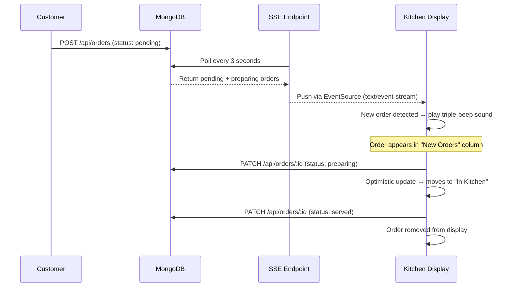

# Bawarchie — QR-Based Restaurant Ordering Platform

A production-ready, multi-tenant SaaS platform for QR code-based restaurant ordering and payments. Customers scan a table QR code, browse the AI-assisted menu, order, and pay — all without a waiter. Installable as a PWA on any mobile device.

> **Final Year Engineering Project** · Built with Next.js 16, MongoDB, Razorpay, OpenAI GPT-4o-mini

---

## Features

| Feature | Description |
|---|---|
| **QR Ordering** | Per-table QR codes route customers directly to their restaurant's live menu |
| **AI Waiter (NL Cart)** | GPT-4o-mini chatbot — recommends dishes, answers questions, and parses natural language ("I'll have 2 paneer tikka") to add items directly to cart |
| **Dietary Filters** | Customer menu filters: All / Veg / Vegan / Gluten-Free / Mild — applied client-side with zero latency |
| **Razorpay Payments** | Full payment flow with GST + 2% platform fee, HMAC-SHA256 signature verification |
| **Kitchen Display System** | Real-time SSE-powered KDS — two-column Kanban, urgency timers, Web Audio sound alerts, fullscreen mode |
| **Analytics Dashboard** | Revenue trends, top items, peak hours heatmap, order status breakdown — 5 parallel MongoDB aggregations |
| **AI Sentiment Feedback** | Post-order reviews with GPT-4o-mini sentiment analysis (score, label, topic tags, summary) |
| **Admin Feedback Dashboard** | Average rating, Amazon-style distribution bars, sentiment breakdown, filterable review cards |
| **PWA (Installable)** | Web App Manifest + Service Worker — cache-first offline support, "Add to Home Screen" on mobile |
| **PDF Receipt** | Print-to-PDF receipt download on order success page with `@media print` CSS |
| **Admin Panel** | Multi-tenant management — menu items (with dietary tags), tables, orders, settings |
| **Super Admin** | Platform-level restaurant approval and oversight |
| **API Security** | `requireAuth()` guard on all admin-facing API routes |

---

## Tech Stack

| Layer | Technology |
|---|---|
| **Frontend** | Next.js 16 (App Router), React 19, TypeScript, Tailwind CSS 4 |
| **Backend** | Next.js API Routes, MongoDB with Mongoose, NextAuth v5 (JWT) |
| **Payments** | Razorpay Orders API, HMAC-SHA256 signature verification |
| **AI** | OpenAI GPT-4o-mini — multi-turn chat, NL cart parsing, sentiment analysis |
| **Real-time** | Server-Sent Events (SSE) for KDS live order stream |
| **Charts** | Recharts — AreaChart, BarChart with MongoDB aggregation pipelines |
| **State** | Zustand with localStorage persistence + billing breakdown |
| **Media** | Cloudinary for item images and QR code storage |
| **PWA** | Web App Manifest (Next.js native) + custom Service Worker |
| **Notifications** | Web Audio API — `OscillatorNode` + `GainNode` triple-beep (zero dependencies) |

---

## System Architecture

```mermaid
graph TD
    A[Customer scans QR] --> B[/r/restaurantSlug/t/tableSlug]
    B --> C[Fetch Restaurant + Table + Menu]
    C --> D[Browse Menu]
    D --> E[Dietary Filter Bar]
    D --> F[AI Waiter Chat]
    F --> G[NL Cart Action Parser]
    G --> H[Add to Cart - Zustand]
    E --> H
    H --> I[Razorpay Checkout]
    I --> J[/api/payments/create-order]
    J --> K[Verify Payment Signature]
    K --> L[POST /api/orders - Save to MongoDB]

    L --> M[Kitchen Display System]
    M --> N[SSE Stream every 3s]
    N --> O[Urgency Timer + Sound Alert]
    O --> P[Mark Preparing / Served]

    L --> Q[Order Success Page]
    Q --> R[Download PDF Receipt]
    Q --> S[AI Feedback + Sentiment]
    S --> T[/api/feedback - GPT-4o-mini analysis]

    U[Restaurant Owner] --> V[Admin Dashboard]
    V --> W[Items - Dietary Tags]
    V --> X[Analytics - 5 aggregations]
    V --> Y[Feedback Dashboard]
    V --> M
```

---

## Kitchen Display System — Real-Time Flow



### Urgency Timer Logic

| Elapsed Time | Border Color | Meaning |
|---|---|---|
| < 5 minutes | Green | Fresh order |
| 5–10 minutes | Yellow | Needs attention |
| > 10 minutes | Red | Urgent — customer waiting |

---

## AI Features

### 1 — AI Waiter Chat (Natural Language Cart)

The AI waiter has full menu context (sections, prices, dietary tags, calories). It:
- Answers questions about dishes, allergens, and recommendations
- Parses ordering intent: *"I'll have 2 butter chicken and a lassi"* → `cartActions[]` → auto-adds to cart
- Returns `suggestedItems[]` shown as inline cards with "+ Add" buttons
- Dietary-aware: knows which items are veg/vegan/gluten-free

```
User: "add 2 paneer tikka and a coke"
→ cartActions: [
    { itemId: "...", name: "Paneer Tikka", qty: 2, action: "add" },
    { itemId: "...", name: "Coke",          qty: 1, action: "add" }
  ]
```

### 2 — Sentiment Analysis on Reviews

After every order, customers can rate (1–5 stars) and leave a text review. GPT-4o-mini returns:

```json
{
  "score": 0.85,
  "label": "positive",
  "tags": ["great service", "tasty food", "fast delivery"],
  "summary": "Customer loved the food quality and quick service."
}
```

Falls back to rule-based scoring if OpenAI is unavailable.

---

## Project Structure

```
orderbyqr/
├── app/
│   ├── manifest.ts                    # PWA Web App Manifest (Next.js native)
│   ├── api/
│   │   ├── ai/
│   │   │   ├── chat/route.ts          # Multi-turn AI waiter + NL cart action parser
│   │   │   └── recommend/route.ts     # Menu recommendation engine
│   │   ├── analytics/route.ts         # 5 parallel MongoDB aggregation pipelines (auth)
│   │   ├── feedback/route.ts          # POST review + AI sentiment; GET summary (auth)
│   │   ├── auth/[...nextauth]/        # NextAuth handlers
│   │   ├── items/[id]/route.ts        # Item CRUD (auth-guarded)
│   │   ├── menu/route.ts              # Menu fetch + update
│   │   ├── orders/
│   │   │   ├── route.ts               # List + create orders
│   │   │   ├── [id]/route.ts          # Update order status (auth)
│   │   │   └── stream/route.ts        # SSE live order stream (Node.js runtime)
│   │   ├── payments/
│   │   │   ├── create-order/route.ts  # Razorpay order + billing breakdown
│   │   │   └── verify/route.ts        # HMAC-SHA256 signature verification
│   │   ├── restaurant/                # Restaurant lookup, stats, settings
│   │   └── tables/
│   │       ├── route.ts               # List + create tables (QR gen → Cloudinary)
│   │       └── [id]/route.ts          # Delete table (auth)
│   ├── admin/[slug]/
│   │   ├── page.tsx                   # Dashboard with quick stats
│   │   ├── layout.tsx                 # Sidebar nav + signOut button
│   │   ├── items/page.tsx             # Item management with dietary tag form + badges
│   │   ├── menu/page.tsx              # Menu section builder
│   │   ├── tables/page.tsx            # Table + QR management
│   │   ├── orders/page.tsx            # Order tracking (5s SWR refresh)
│   │   ├── kitchen/page.tsx           # Kitchen Display System (SSE + audio)
│   │   ├── analytics/page.tsx         # Analytics dashboard (Recharts)
│   │   ├── feedback/page.tsx          # Review dashboard with sentiment analysis
│   │   └── settings/page.tsx          # Payment + GST settings
│   ├── auth/
│   │   ├── login/page.tsx
│   │   └── signup/page.tsx
│   ├── super-admin/                   # Platform admin panel
│   ├── r/[restaurantSlug]/t/[tableSlug]/
│   │   └── page.tsx                   # Customer menu + dietary filters + AI chat
│   └── order-success/
│       ├── page.tsx
│       └── order-success.tsx          # Receipt + PDF download + AI feedback form
├── components/
│   ├── admin/
│   │   ├── AdminHeader.tsx
│   │   └── AdminFooter.tsx
│   ├── MenuAIChat.tsx                 # Floating AI waiter widget (quick prompts + NL cart)
│   ├── ServiceWorkerRegistration.tsx  # Registers /sw.js on mount (PWA)
│   ├── ItemCard.tsx
│   ├── Cart.tsx
│   ├── RazorpayCheckout.tsx
│   └── RootLayoutClient.tsx
├── lib/
│   ├── auth.ts                        # NextAuth config (JWT, credentials)
│   ├── db.js                          # MongoDB connection pool
│   ├── models/
│   │   ├── Restaurant.js
│   │   ├── Item.js                    # + isVeg, isVegan, isGlutenFree, spiceLevel
│   │   ├── Menu.js
│   │   ├── Table.js
│   │   ├── Order.js                   # With GST + platform fee fields
│   │   └── Feedback.js                # Rating + text + AI sentiment result
│   ├── store/useCartStore.ts          # Zustand cart — addItem(item, qty)
│   └── utils/
│       ├── apiAuth.ts                 # requireAuth() guard for API routes
│       ├── billing.ts                 # GST + 2% platform fee calculation
│       └── password.ts               # bcrypt helpers
├── public/
│   ├── sw.js                          # Service Worker (cache-first + offline fallback)
│   └── logoBawa.png                   # App icon (used in PWA manifest)
└── middleware.ts                      # Route protection for /admin/* and /super-admin/*
```

---

## API Reference

### Auth
| Method | Route | Description |
|---|---|---|
| `POST` | `/api/auth/signup` | Register restaurant (status: pending) |
| `POST` | `/api/auth/[...nextauth]` | NextAuth sign in/out |

### Menu & Items
| Method | Route | Description |
|---|---|---|
| `GET` | `/api/menu?restaurantId=` | Fetch menu with populated sections |
| `GET` | `/api/items?restaurantId=` | List restaurant items |
| `POST` | `/api/items` | Create item (with dietary fields) |
| `PATCH` | `/api/items/:id` | Update item (auth) |
| `DELETE` | `/api/items/:id` | Delete item (auth) |

### Tables
| Method | Route | Description |
|---|---|---|
| `GET` | `/api/tables?restaurantId=` | List tables |
| `GET` | `/api/tables?slug=` | Lookup table by slug (customer) |
| `POST` | `/api/tables` | Create table + generate + upload QR (auth) |
| `DELETE` | `/api/tables/:id` | Delete table (auth) |

### Orders
| Method | Route | Description |
|---|---|---|
| `GET` | `/api/orders?restaurantId=` | List all orders |
| `POST` | `/api/orders` | Place order |
| `PATCH` | `/api/orders/:id` | Update order status (auth) |
| `GET` | `/api/orders/stream?restaurantId=` | SSE live stream (Node.js runtime, auth) |

### Payments
| Method | Route | Description |
|---|---|---|
| `POST` | `/api/payments/create-order` | Create Razorpay order with billing breakdown |
| `POST` | `/api/payments/verify` | Verify HMAC-SHA256 payment signature |

### Analytics
| Method | Route | Description |
|---|---|---|
| `GET` | `/api/analytics?restaurantId=&range=30` | Revenue, top items, peak hours, summary (auth) |

### AI
| Method | Route | Description |
|---|---|---|
| `POST` | `/api/ai/recommend` | Menu recommendations by query |
| `POST` | `/api/ai/chat` | Multi-turn AI waiter + NL cart action parsing |

### Feedback
| Method | Route | Description |
|---|---|---|
| `POST` | `/api/feedback` | Submit review — runs GPT-4o-mini sentiment analysis |
| `GET` | `/api/feedback?restaurantId=` | Fetch reviews + precomputed summary (auth) |

---

## Billing Logic

Every order goes through a 3-step calculation:

```
baseTotal   = Σ (item.price × qty)
gstAmount   = baseTotal × (gstPercentage / 100)
platformFee = (baseTotal + gstAmount) × 0.02
finalAmount = baseTotal + gstAmount + platformFee

restaurantEarnings = finalAmount - platformFee
platformEarnings   = platformFee
```

GST percentage is configured per restaurant (0%, 5%, 12%, or 18%) and snapshotted on each order at creation time.

---

## PWA Support

Bawarchie is fully installable as a Progressive Web App:

- **Manifest** (`/manifest.webmanifest`): app name, icons, standalone display mode, green `#16a34a` theme
- **Service Worker** (`/sw.js`): cache-first for pages and static assets, network-first for `/api/*`, offline JSON fallback for API failures
- **Install prompt**: Chrome/Edge show "Add to Home Screen" automatically when criteria are met; Safari shows the Share → Add to Home Screen option

---

## Setup

### Prerequisites

- Node.js 18+
- MongoDB Atlas or local MongoDB
- Razorpay account (test credentials work fine)
- OpenAI API key
- Cloudinary account

### Install

```bash
git clone <repo-url>
cd orderbyqr
npm install
```

### Environment Variables

Create `.env.local`:

```env
MONGODB_URI=mongodb+srv://...
NEXTAUTH_SECRET=your-secret-here
NEXTAUTH_URL=http://localhost:3000
NEXT_PUBLIC_BASE_URL=http://localhost:3000

OPENAI_API_KEY=sk-...

RAZORPAY_KEY_ID=rzp_test_...
RAZORPAY_KEY_SECRET=...
NEXT_PUBLIC_RAZORPAY_KEY_ID=rzp_test_...

CLOUDINARY_CLOUD_NAME=...
CLOUDINARY_API_KEY=...
CLOUDINARY_API_SECRET=...

SUPER_ADMIN_EMAIL=admin@bawarchie.com
SUPER_ADMIN_PASSWORD=your-admin-password
```

### Run

```bash
npm run dev       # development
npm run build     # production build
npm run start     # production server
```

---

## Revenue Model

Bawarchie operates as a SaaS platform:

- Restaurants sign up and are approved by the super admin
- Each order incurs a **2% platform fee** automatically calculated and stored
- The platform dashboard (super admin) can track total `myEarnings` across all restaurants
- Restaurants configure their own Razorpay keys and GST rate

---

## Security

- **Route protection**: `middleware.ts` guards `/admin/*` and `/super-admin/*` with NextAuth session checks
- **API protection**: `lib/utils/apiAuth.ts` — `requireAuth()` called at the top of every admin-facing API handler
- **Payment verification**: Razorpay HMAC-SHA256 signature verified server-side before any order is saved
- **Password hashing**: bcryptjs with salt rounds
- **Multi-tenant isolation**: All queries scoped by `restaurantId`; admin layout verifies session user owns the slug
