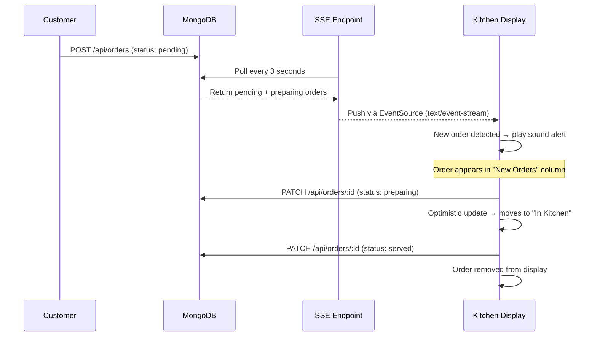

# Bawarchie — QR-Based Restaurant Ordering Platform

A production-ready, multi-tenant SaaS platform for QR code-based restaurant ordering and payments. Customers scan a table QR code, browse the AI-assisted menu, order, and pay — all without a waiter.

> **Final Year Engineering Project** · Built with Next.js 16, MongoDB, Razorpay, OpenAI GPT-4o-mini

---

## Features

| Feature | Description |
|---|---|
| **QR Ordering** | Per-table QR codes route customers directly to their restaurant's menu |
| **AI Waiter** | GPT-4o-mini chatbot with full menu context — recommends dishes, answers questions, adds items to cart |
| **Razorpay Payments** | Full payment flow with GST + 2% platform fee calculation and signature verification |
| **Kitchen Display System** | Real-time SSE-powered KDS with urgency timers and sound notifications |
| **Analytics Dashboard** | Revenue trends, top items, peak hours heatmap, order status breakdown |
| **Admin Panel** | Multi-tenant restaurant management — menu, items, tables, orders, settings |
| **Super Admin** | Platform-level restaurant approval and oversight |
| **API Security** | Session-based auth guard on all admin-facing API routes |

---

## Tech Stack

- **Frontend**: Next.js 16 (App Router), React 19, TypeScript, Tailwind CSS 4
- **Backend**: Next.js API Routes, MongoDB with Mongoose, NextAuth v5
- **Payments**: Razorpay Orders API with HMAC-SHA256 signature verification
- **AI**: OpenAI GPT-4o-mini — chat + structured JSON recommendations
- **Real-time**: Server-Sent Events (SSE) for KDS live order stream
- **Charts**: Recharts — AreaChart, BarChart with MongoDB aggregation pipelines
- **State**: Zustand with localStorage persistence
- **Media**: Cloudinary for item images and QR code storage
- **QR Codes**: `qrcode` library → uploaded to Cloudinary

---

## System Architecture

```mermaid
graph TD
    A[Customer scans QR] --> B[/r/restaurantSlug/t/tableSlug]
    B --> C[Fetch Restaurant + Table + Menu]
    C --> D[Browse Menu + AI Waiter Chat]
    D --> E[Add to Cart - Zustand]
    E --> F[Razorpay Checkout]
    F --> G[/api/payments/create-order]
    G --> H[Verify Payment Signature]
    H --> I[/api/orders POST - Save to MongoDB]

    I --> J[Kitchen Display System]
    J --> K[SSE Stream polls every 3s]
    K --> L[Kitchen accepts order]
    L --> M[Mark as Served]

    I --> N[Admin Orders Page]
    I --> O[Analytics Aggregation]

    P[Restaurant Owner] --> Q[Admin Dashboard]
    Q --> R[Manage Items / Menu / Tables]
    Q --> S[View Orders]
    Q --> T[Analytics Dashboard]
    Q --> J
```

---

## Kitchen Display System — Real-Time Flow



### Urgency Timer Logic

| Elapsed Time | Border Color | Meaning |
|---|---|---|
| < 5 minutes | Green | Fresh order |
| 5–10 minutes | Yellow | Needs attention |
| > 10 minutes | Red | Urgent — customer waiting |

---

## Project Structure

```
orderbyqr/
├── app/
│   ├── api/
│   │   ├── ai/
│   │   │   ├── chat/route.ts          # Multi-turn AI waiter chatbot
│   │   │   └── recommend/route.ts     # Menu recommendation engine
│   │   ├── analytics/route.ts         # MongoDB aggregation pipeline
│   │   ├── auth/[...nextauth]/        # NextAuth handlers
│   │   ├── items/[id]/route.ts        # Item CRUD (auth-guarded)
│   │   ├── menu/route.ts              # Menu fetch + update
│   │   ├── orders/
│   │   │   ├── route.ts               # List + create orders
│   │   │   ├── [id]/route.ts          # Update order status (auth-guarded)
│   │   │   └── stream/route.ts        # SSE live order stream (Node.js runtime)
│   │   ├── payments/
│   │   │   ├── create-order/route.ts  # Razorpay order creation + billing breakdown
│   │   │   └── verify/route.ts        # HMAC signature verification
│   │   ├── restaurant/                # Restaurant lookup, stats, settings
│   │   └── tables/
│   │       ├── route.ts               # List + create tables (QR gen → Cloudinary)
│   │       └── [id]/route.ts          # Delete table (auth-guarded)
│   ├── admin/[slug]/
│   │   ├── page.tsx                   # Dashboard with quick stats
│   │   ├── layout.tsx                 # Sidebar nav + auth guard
│   │   ├── items/page.tsx             # Menu item management
│   │   ├── menu/page.tsx              # Menu section builder
│   │   ├── tables/page.tsx            # Table + QR management
│   │   ├── orders/page.tsx            # Order tracking (5s SWR refresh)
│   │   ├── kitchen/page.tsx           # Kitchen Display System (SSE)
│   │   ├── analytics/page.tsx         # Analytics dashboard (Recharts)
│   │   └── settings/page.tsx          # Payment + GST settings
│   ├── auth/
│   │   ├── login/page.tsx
│   │   └── signup/page.tsx
│   ├── super-admin/                   # Platform admin panel
│   ├── r/[restaurantSlug]/t/[tableSlug]/
│   │   └── page.tsx                   # Customer-facing menu + cart + AI chat
│   └── order-success/page.tsx
├── components/
│   ├── admin/
│   │   ├── AdminHeader.tsx
│   │   └── AdminFooter.tsx
│   ├── MenuAIChat.tsx                 # Floating AI waiter widget
│   ├── ItemCard.tsx
│   ├── Cart.tsx
│   ├── RazorpayCheckout.tsx
│   └── RootLayoutClient.tsx           # Conditional header/footer
├── lib/
│   ├── auth.ts                        # NextAuth config (JWT, credentials)
│   ├── db.js                          # MongoDB connection pool
│   ├── models/
│   │   ├── Restaurant.js
│   │   ├── Item.js
│   │   ├── Menu.js
│   │   ├── Table.js
│   │   └── Order.js                   # With GST + platform fee fields
│   ├── store/useCartStore.ts          # Zustand cart with billing breakdown
│   └── utils/
│       ├── apiAuth.ts                 # requireAuth() guard for API routes
│       ├── billing.ts                 # GST + 2% platform fee calculation
│       └── password.ts               # bcrypt helpers
└── middleware.ts                      # Next.js route protection
```

---

## API Reference

### Auth
| Method | Route | Description |
|---|---|---|
| `POST` | `/api/auth/signup` | Register restaurant (status: pending) |
| `POST` | `/api/auth/[...nextauth]` | NextAuth sign in/out |

### Menu & Items
| Method | Route | Description |
|---|---|---|
| `GET` | `/api/menu?restaurantId=` | Fetch menu with populated sections |
| `GET` | `/api/items?restaurantId=` | List restaurant items |
| `POST` | `/api/items` | Create item |
| `PATCH` | `/api/items/:id` | Update item (auth) |
| `DELETE` | `/api/items/:id` | Delete item (auth) |

### Tables
| Method | Route | Description |
|---|---|---|
| `GET` | `/api/tables?restaurantId=` | List tables |
| `GET` | `/api/tables?slug=` | Lookup table by slug (customer) |
| `POST` | `/api/tables` | Create table + generate + upload QR (auth) |
| `DELETE` | `/api/tables/:id` | Delete table (auth) |

### Orders
| Method | Route | Description |
|---|---|---|
| `GET` | `/api/orders?restaurantId=` | List all orders |
| `POST` | `/api/orders` | Place order |
| `PATCH` | `/api/orders/:id` | Update order status (auth) |
| `GET` | `/api/orders/stream?restaurantId=` | SSE live stream (auth) |

### Payments
| Method | Route | Description |
|---|---|---|
| `POST` | `/api/payments/create-order` | Create Razorpay order with GST + fee breakdown |
| `POST` | `/api/payments/verify` | Verify HMAC-SHA256 payment signature |

### Analytics
| Method | Route | Description |
|---|---|---|
| `GET` | `/api/analytics?restaurantId=&range=30` | Revenue, top items, peak hours, summary (auth) |

### AI
| Method | Route | Description |
|---|---|---|
| `POST` | `/api/ai/recommend` | Menu recommendations by query |
| `POST` | `/api/ai/chat` | Multi-turn AI waiter conversation |

---

## Billing Logic

Every order goes through a 3-step calculation:

```
baseTotal   = Σ (item.price × qty)
gstAmount   = baseTotal × (gstPercentage / 100)
platformFee = (baseTotal + gstAmount) × 0.02
finalAmount = baseTotal + gstAmount + platformFee

restaurantEarnings = finalAmount - platformFee
platformEarnings   = platformFee
```

GST percentage is configured per restaurant (0%, 5%, 12%, or 18%) and snapshotted on each order.

---

## Setup

### Prerequisites

- Node.js 18+
- MongoDB Atlas or local MongoDB
- Razorpay account (test credentials work fine)
- OpenAI API key
- Cloudinary account

### Install

```bash
git clone <repo-url>
cd orderbyqr
npm install
```

### Environment Variables

Create `.env.local`:

```env
MONGODB_URI=mongodb+srv://...
NEXTAUTH_SECRET=your-secret-here
NEXTAUTH_URL=http://localhost:3000
NEXT_PUBLIC_BASE_URL=http://localhost:3000

OPENAI_API_KEY=sk-...

RAZORPAY_KEY_ID=rzp_test_...
RAZORPAY_KEY_SECRET=...
NEXT_PUBLIC_RAZORPAY_KEY_ID=rzp_test_...

CLOUDINARY_CLOUD_NAME=...
CLOUDINARY_API_KEY=...
CLOUDINARY_API_SECRET=...

SUPER_ADMIN_EMAIL=admin@bawarchie.com
SUPER_ADMIN_PASSWORD=your-admin-password
```

### Run

```bash
npm run dev       # development
npm run build     # production build
npm run start     # production server
```

---

## Revenue Model

Bawarchie operates as a SaaS platform:

- Restaurants sign up and are approved by the super admin
- Each order incurs a **2% platform fee** automatically calculated and stored
- The platform dashboard (super admin) can track total `myEarnings` across all restaurants
- Restaurants configure their own Razorpay keys and GST rate

---

## Security

- **Route protection**: `middleware.ts` guards `/admin/*` and `/super-admin/*` with NextAuth session checks
- **API protection**: `lib/utils/apiAuth.ts` — `requireAuth()` called at the top of every admin-facing API handler
- **Payment verification**: Razorpay HMAC-SHA256 signature verified server-side before order is saved
- **Password hashing**: bcryptjs with salt rounds
- **Multi-tenant isolation**: All queries scoped by `restaurantId`; admin layout verifies session user owns the slug
